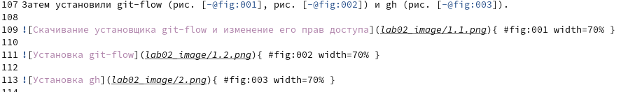

---
## Front matter
lang: ru-RU
title: Лабораторная работа №3
subtitle: Markdown
author: Желдакова Виктория Алексеевна
institute: RUDN University, Moscow, Russian Federation
date: Москва 2022 г.

## I18n polyglossia
polyglossia-lang:
  name: russian
  options:
	- spelling=modern
	- babelshorthands=true
polyglossia-otherlangs:
  name: english
## I18n babel
babel-lang: russian
babel-otherlangs: english
## Fonts
mainfont: PT Serif
romanfont: PT Serif
sansfont: PT Sans
monofont: PT Mono
mainfontoptions: Ligatures=TeX
romanfontoptions: Ligatures=TeX
sansfontoptions: Ligatures=TeX,Scale=MatchLowercase
monofontoptions: Scale=MatchLowercase,Scale=0.9

## Formatting
toc: false
slide_level: 2
theme: metropolis
header-includes: 
 - \metroset{progressbar=frametitle,sectionpage=progressbar,numbering=fraction}
 - '\makeatletter'
 - '\beamer@ignorenonframefalse'
 - '\makeatother'
aspectratio: 43
section-titles: true
---

## Цель работы

Научиться оформлять отчёты с помощью легковесного языка разметки Markdown.

## Задание

- Сделайте отчёт по предыдущей лабораторной работе в формате Markdown.

- В качестве отчёта просьба предоставить отчёты в 3 форматах: pdf, docx и md (в архиве,
поскольку он должен содержать скриншоты, Makefile и т.д.).

# Выполнение лабораторной работы

## Подготовка

Перед началом выполнения лабораторной работы мы скачали pandoc, pandoc-crossref и pandoc-citeproc.

## Создание отчёта

Для подготовки отчёта мы используем заранее подготовленный шаблон для данной лабораторной работы. Начинаем переносить основные пункты лабораторной №2 в Markdown файл.

Вставку изображений и ссылки на изображения оформляем по приведённому шаблону:

## Создание отчета

Полностью переносим данные в Markdown и переходим к конвертированию в другие форматы.

Проведём конвертацию и проверим корректность конвертации файла.

## Вывод

Научились оформлять отчёты с помощью легковесного языка разметки Markdown и конвертировать их в форматы docx и pdf.

