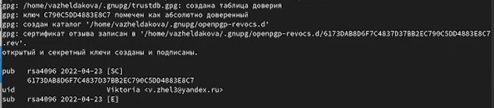

---
## Front matter
title: "Отчёт по лабораторной работе №2"
subtitle: "Управление версиями"
author: "Желдакова Виктория Алексеевна"

## Generic otions
lang: ru-RU
toc-title: "Содержание"

## Bibliography
bibliography: bib/cite.bib
csl: pandoc/csl/gost-r-7-0-5-2008-numeric.csl

## Pdf output format
toc: true # Table of contents
toc-depth: 2
lof: true # List of figures
lot: true # List of tables
fontsize: 12pt
linestretch: 1.5
papersize: a4
documentclass: scrreprt
## I18n polyglossia
polyglossia-lang:
  name: russian
  options:
	- spelling=modern
	- babelshorthands=true
polyglossia-otherlangs:
  name: english
## I18n babel
babel-lang: russian
babel-otherlangs: english
## Fonts
mainfont: PT Serif
romanfont: PT Serif
sansfont: PT Sans
monofont: PT Mono
mainfontoptions: Ligatures=TeX
romanfontoptions: Ligatures=TeX
sansfontoptions: Ligatures=TeX,Scale=MatchLowercase
monofontoptions: Scale=MatchLowercase,Scale=0.9
## Biblatex
biblatex: true
biblio-style: "gost-numeric"
biblatexoptions:
  - parentracker=true
  - backend=biber
  - hyperref=auto
  - language=auto
  - autolang=other*
  - citestyle=gost-numeric
## Pandoc-crossref LaTeX customization
figureTitle: "Рис."
tableTitle: "Таблица"
listingTitle: "Листинг"
lofTitle: "Список иллюстраций"
lotTitle: "Список таблиц"
lolTitle: "Листинги"
## Misc options
indent: true
header-includes:
  - \usepackage{indentfirst}
  - \usepackage{float} # keep figures where there are in the text
  - \floatplacement{figure}{H} # keep figures where there are in the text
---

# Цель работы

1. Изучить идеологию и применение средств контроля версий.
2. Освоить умения по работе с git.

# Задание

– Создать базовую конфигурацию для работы с git.

– Создать ключ SSH.

– Создать ключ PGP.

– Настроить подписи git.

– Зарегистрироваться на Github.

– Создать локальный каталог для выполнения заданий по предмету.

# Теоретическое введение

Системы контроля версий (Version Control System, VCS) применяются при работе нескольких человек над одним проектом. Обычно основное дерево проекта хранится в локальном или удалённом репозитории, к которому настроен доступ для участников проекта. При внесении изменений в содержание проекта система контроля версий позволяет их фиксировать, совмещать изменения, произведённые разными участниками проекта, производить откат к любой более ранней версии проекта, если это требуется.

В классических системах контроля версий используется централизованная модель, предполагающая наличие единого репозитория для хранения файлов. Выполнение большинства функций по управлению версиями осуществляется специальным сервером. Участник проекта (пользователь) перед началом работы посредством определённых команд получает нужную ему версию файлов. После внесения изменений, пользователь размещает новую версию в хранилище. При этом предыдущие версии не удаляются из центрального хранилища и к ним можно вернуться в любой момент. Сервер может сохранять не полную версию изменённых файлов, а производить так называемую дельтакомпрессию — сохранять только изменения между последовательными версиями, что позволяет уменьшить объём хранимых данных.
 
Системы контроля версий поддерживают возможность отслеживания и разрешения конфликтов, которые могут возникнуть при работе нескольких человек над одним файлом. Можно объединить (слить) изменения, сделанные разными участниками (автоматически или вручную), вручную выбрать нужную версию, отменить изменения вовсе или заблокировать файлы для изменения. В зависимости от настроек блокировка не позволяет другим пользователям получить рабочую копию или препятствует изменению рабочей копии файла средствами файловой системы ОС, обеспечивая таким образом, привилегированный доступ только одному пользователю, работающему с файлом.
 
Системы контроля версий также могут обеспечивать дополнительные, более гибкие функциональные возможности. Например, они могут поддерживать работу с несколькими версиями одного файла, сохраняя общую историю изменений до точки ветвления версий и собственные истории изменений каждой ветви. Кроме того, обычно доступна информация о том, кто из участников, когда и какие изменения вносил. Обычно такого рода информация хранится в журнале изменений, доступ к которому можно ограничить.

В отличие от классических, в распределённых системах контроля версий центральный репозиторий не является обязательным.

Среди классических VCS наиболее известны CVS, Subversion, а среди распределённых — Git, Bazaar, Mercurial. Принципы их работы схожи, отличаются они в основном синтаксисом используемых в работе команд.

# Выполнение лабораторной работы

Во-первых, мы создали учётную запись на github.com и заполнили основные данные о себе.

Затем установили git-flow (рис. [-@fig:001], рис. [-@fig:002]) и gh (рис. [-@fig:003]).

{ #fig:001 width=70% }

{ #fig:002 width=70% }

{ #fig:003 width=70% }

Затем задали имя и email владельца репозитория, настроили utf-8 в выводе сообщений git, а также верификацию и подписание коммитов git. Дали имя «master» начальной ветке. Настроили параметры autocrlf и safecrlf (рис. [-@fig:004]).

{ #fig:004 width=70% }

Создали ключи SSH по алгоритмам RSA и ed25519 (рис. [-@fig:005], рис. [-@fig:006]).

{ #fig:005 width=70% }

{ #fig:006 width=70% }

Сгенерировали GPG ключ (рис. [-@fig:007], рис. [-@fig:008]).

{ #fig:007 width=70% }

{ #fig:008 width=70% }

Вывели список ключей (рис. [-@fig:009]) и скопировали отпечаток приватного ключа, затем скопировали сгенерированный ключ в буфер обмена (рис. [-@fig:010])и вставили полученный ключ в поле ввода в настройках GitHub (рис. [-@fig:011]). (Так же пришлось установить утилиту xclip для копирования в буфер).

{ #fig:009 width=70% }

{ #fig:010 width=70% }

{ #fig:011 width=70% }

Настроили автоматическую подпись коммитов git (рис. [-@fig:012]).

{ #fig:012 width=70% }

Затем авторизовались на github.com (рис. [-@fig:013]).

{ #fig:013 width=70% }

Создали каталог «Операционные системы», в нём создали репозиторий (рис. [-@fig:014]) и клонировали шаблон (рис. [-@fig:015]).

{ #fig:014 width=70% }

{ #fig:015 width=70% }

Перешли в каталог курса, удалили лишние файлы, создали необходимые каталоги (рис. [-@fig:016]) и отправили файлы на сервер (рис. [-@fig:017]).

{ #fig:016 width=70% }

{ #fig:017 width=70% }

# Выводы

Изучили идеологию и применение средств контроля версий. Получили практические навыки по работе с git.

# Контрольные вопросы

1. Что такое системы контроля версий (VCS) и для решения каких задач они предназначаются?

Система контроля версий (Version Control System, VCS) представляет собой программное обеспечение, которое позволяет отслеживать изменения в документах, при необходимости производить их откат, определять, кто и когда внес исправления и т.п.

Она предназначается для задач, когда необходимо часто вносить изменения в проект, но при этом должна сохраняться работоспособность. VCS отслеживает изменения в файлах, предоставляет возможности для создания новых и слияние существующих ветвей проекта, производит контроль доступа пользователей к проекту, позволяет откатывать исправления и определять кто, когда и какие изменения вносил в проект.

2. Объясните следующие понятия VCS и их отношения: хранилище, commit, история, рабочая копия.

Основным понятием VCS является репозиторий (repository) – специальное хранилище файлов и папок проекта, изменения в которых отслеживаются. В распоряжении разработчика имеется так называемая “рабочая копия” (working copy) проекта, с которой он непосредственно работает. Рабочую копию необходимо периодически синхронизировать с репозиторием, эта операция предполагает отправку в него изменений, которые пользователь внес в свою рабочую копию (такая операция называется commit), при запуске команды git log можно получить список последних коммитов в обратном хронологическом порядке (историю).

3. Что представляют собой и чем отличаются централизованные и децентрализованные VCS? Приведите примеры VCS каждого вида. 

Централизованные системы контроля версий представляют собой приложения типа клиент-сервер, когда репозиторий проекта существует в единственном экземпляре и хранится на сервере. Доступ к нему осуществлялся через специальное клиентское приложение. В качестве примеров таких программных продуктов можно привести CVS, Subversion.

Распределенные системы контроля версий (Distributed Version Control System, DVCS) позволяют хранить репозиторий (его копию) у каждого разработчика, работающего с данной системой. При этом можно выделить центральный репозиторий (условно), в который будут отправляться изменения из локальных и, с ним же эти локальные репозитории будут синхронизироваться. Две наиболее известные DVCS – это Git и Mercurial.

4. Опишите действия с VCS при единоличной работе с хранилищем.

Разработчик работает с начальной веткой, для разных частей проекта может создать отдельные ветки. После внесения изменений разработчик коммитит (commit) и пушит (push) их, то есть сохраняет изменения в общем хранилище.

5. Опишите порядок работы с общим хранилищем VCS.

Каждый разработчик работает над отдельной частью проекта в своей ветке или над изменениями, сделанными другими разработчиками. После внесения изменений разработчик коммитит (commit) и пушит (push) их в общее хранилище. В конце работы необходимо выполнить слияние (merge) веток, например, с начальной.

6. Каковы основные задачи, решаемые инструментальным средством git?

С помощью Git-a вы можете откатить свой проект до более старой версии, сравнивать, анализировать или сливать свои изменения в репозиторий.

7. Назовите и дайте краткую характеристику командам git.

– создание основного дерева репозитория: git init

– получение обновлений (изменений) текущего дерева из центрального репозитория: git pull

– отправка всех произведённых изменений локального дерева в центральный репозиторий: git push

– просмотр списка изменённых файлов в текущей директории: git status

– просмотр текущих изменения: git diff

– сохранение текущих изменений:

	– добавить все изменённые и/или созданные файлы и/или каталоги: git add
	– добавить конкретные изменённые и/или созданные файлы и/или каталоги: git add имена_файлов
	
– удалить файл и/или каталог из индекса репозитория (при этом файл и/или каталог остаётся в локальной директории): git rm имена_файлов

– сохранение добавленных изменений:

	– сохранить все добавленные изменения и все изменённые файлы: git commit -am 'Описание коммита'	
	– сохранить добавленные изменения с внесением комментария через встроенный редактор: git commit
	
– создание новой ветки, базирующейся на текущей: git checkout -b имя_ветки

– переключение на некоторую ветку: git checkout имя_ветки

– отправка изменений конкретной ветки в центральный репозиторий: git push origin имя_ветки

– слияние ветки с текущим деревом: git merge --no-ff имя_ветки

– удаление ветки:

	– удаление локальной уже слитой с основным деревом ветки: git branch -d имя_ветки
	– принудительное удаление локальной ветки: git branch -D имя_ветки
	– удаление ветки с центрального репозитория: git push origin :имя_ветки
		
8. Приведите примеры использования при работе с локальным и удалённым репозиториями.

Первый разработчик начал верстать проект и сделал первые коммиты, в которых зафиксировал изменения в определённом файле. После того как он сделал два коммита, он захотел отправить свои изменения в удалённый репозиторий. Чтобы их передать, разработчик выполнил команду git push. После чего в облаке появилось две версии проекта. То есть он отправил не только финальную версию проекта, но и все сохранённые изменения.

После пуша данные синхронизировались с удалённым репозиторием. Для того, чтобы получить эти изменения, другой разработчик выполняет команду git pull и получает все изменения из облака к себе на компьютер. Таким образом, состояние проекта у обоих синхронизировалось, и они могут дальше продолжить работать над ним.

9. Что такое и зачем могут быть нужны ветви (branches)?

Branches (ветки) представляют собой отдельные копии проекта. Они используются для одновременной разработки отдельных частей проекта.

10. Как и зачем можно игнорировать некоторые файлы при commit?

Для игнорирования файлов при commit используют файл .gitignor. В него записываются файлы, которые не нужны для проекта, например, временные файлы, создаваемые редакторами, системные файлы и скомпилированный код.	

