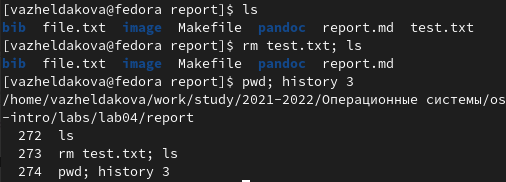

---
## Front matter
title: "Отчёт по лаборатной работе №4"
subtitle: "Основы интерфейса взаимодействия пользователя с системой Unix на уровне командной строки"
author: "Желдакова Виктория Алексеевна"

## Generic otions
lang: ru-RU
toc-title: "Содержание"

## Bibliography
bibliography: bib/cite.bib
csl: pandoc/csl/gost-r-7-0-5-2008-numeric.csl

## Pdf output format
toc: true # Table of contents
toc-depth: 2
lof: true # List of figures
lot: true # List of tables
fontsize: 12pt
linestretch: 1.5
papersize: a4
documentclass: scrreprt
## I18n polyglossia
polyglossia-lang:
  name: russian
  options:
	- spelling=modern
	- babelshorthands=true
polyglossia-otherlangs:
  name: english
## I18n babel
babel-lang: russian
babel-otherlangs: english
## Fonts
mainfont: PT Serif
romanfont: PT Serif
sansfont: PT Sans
monofont: PT Mono
mainfontoptions: Ligatures=TeX
romanfontoptions: Ligatures=TeX
sansfontoptions: Ligatures=TeX,Scale=MatchLowercase
monofontoptions: Scale=MatchLowercase,Scale=0.9
## Biblatex
biblatex: true
biblio-style: "gost-numeric"
biblatexoptions:
  - parentracker=true
  - backend=biber
  - hyperref=auto
  - language=auto
  - autolang=other*
  - citestyle=gost-numeric
## Pandoc-crossref LaTeX customization
figureTitle: "Рис."
tableTitle: "Таблица"
listingTitle: "Листинг"
lofTitle: "Список иллюстраций"
lotTitle: "Список таблиц"
lolTitle: "Листинги"
## Misc options
indent: true
header-includes:
  - \usepackage{indentfirst}
  - \usepackage{float} # keep figures where there are in the text
  - \floatplacement{figure}{H} # keep figures where there are in the text
---

# Цель работы

Приобретение практических навыков взаимодействия пользователя с системой посредством командной строки. 

# Теоретическое введение

Командная строка – это текстовый интерфейс, предназначенный для взаимодействия человека с компьютером, в котором команды отдаются путем ввода текстовых строк с клавиатуры.

Командой в операционной системе называется записанный по специальным правилам текст (возможно с аргументами), представляющий собой указание на выполнение какой-либо функций (или действий) в операционной системе. Обычно первым словом идёт имя команды, остальной текст — аргументы или опции, конкретизирующие действие.

# Выполнение лабораторной работы

1. Определили полное имя домашнего каталога с помощью команды pwd (рис. [-@fig:001]).

{ #fig:001 width=70% }

2. Перешли в каталог /tmp и вывели на экран содержимое каталога, используя команду ls с опциями a, l, и F (рис. [-@fig:002] и рис. [-@fig:003]).

ls -a выводит содержимое каталогов включая скрытые файлы.

ls -l выводит тип каждого файла, право доступа, число ссылок, владельца, размер, дату последней ревизии и имя файла/каталога.

ls -F выводит содержимое каталога с указанием типа файла.

{ #fig:002 width=70% }

{ #fig:003 width=70% }

Затем перешли в каталог /var/spool и с помощью команды убедились в том, что в нём не содержится подкаталога с именем cron (рис. [-@fig:004]). 

{ #fig:004 width=70% }

Вернулись в домашний каталог, вывели на экран его содержимое и определи владельца файлов и каталогов с помощью команды ls  с опцией l (рис. [-@fig:005]). Владельцем файлов и каталогов является моя учётная запись.

{ #fig:005 width=70% }

3. В домашнем каталоге создадим новый каталог newdir, а в нём новый каталог с именем morefun. Затем в домашнем каталоге одной командой mkdir создадим три новых каталога и удалим их тоже одной командой rmdir. Попробуем удалить каталог newdir командой rm, но получим ошибку т.к. этой команде необходима опция r для удаления непустого каталога. С помощью команды rmdir удалим каталог morefun и проверим, что он действительно был удалён (рис. [-@fig:006]). 

{ #fig:006 width=70% }

4. С помощью команды man определим опцию -R для команды ls для просмотра содержимого не только указанного каталога, но и подкаталогов, входящих в него (рис. [-@fig:007]).

{ #fig:007 width=70% }

5. С помощью команды man для команды ls определим набор опций l и t, позволяющий отсортировать по времени последнего изменения выводимый список содержимого каталога с развёрнутым описанием файлов (рис. [-@fig:008]).

{ #fig:008 width=70% }

6. Используя команду man для просмотра описания команд cd, pwd, mkdir, rmdir и rm определили их основные функции (рис. [-@fig:009]).

Для cd это опции: P (позволяет следовать по символическим ссылкам перед тем, как будут обработаны все переходы), L (переходит по символическим ссылкам только после того, как были обработаны все переходы), e (если папку, в которую нужно перейти не удалось найти - выдает ошибку).

Для pwd это опции: L, --logical (брать директорию из переменной окружения, даже если она содержит символические ссылки), P (отбрасывать все символические ссылки).

Для mkdir это опции: p (создать все директории, которые указаны внутри пути. Если какая-либо директория существует, то предупреждение об этом не выводится), v (выводить сообщение о каждой создаваемой директории), -m=MODE (устанавливает права доступа для создаваемой директории).

Для rmdir это опции: p (позволяет удалить папку через командную строку, а также её родительские каталоги), v (выводит диагностический текст для каждого обработанного каталога).

Для rm это опции: d (удаление пустых каталогов), r (рекурсивно удаляет каталоги и их содержимое), i (запрос подтверждения на удаление каждого файла).

{ #fig:009 width=70% }

7. Используя информацию, полученную при помощи команды history, выполнили модификацию и исполнение нескольких команд из буфера команд (рис. [-@fig:010]).

{ #fig:010 width=70% }

# Выводы

Приобрели практические навыки взаимодействия пользователя с системой посредством командной строки и изучили основные команды, необходимые для работы с системой. 

# Контрольные вопросы

1. Что такое командная строка?

Командная строка – это текстовый интерфейс, предназначенный для взаимодействия человека с компьютером, в котором команды отдаются путем ввода текстовых строк с клавиатуры.

2. При помощи какой команды можно определить абсолютный путь текущего каталога? Приведите пример.

Для определения абсолютного пути текущего каталога используют команду pwd (рис. [-@fig:011]).

{ #fig:011 width=70% }

3. При помощи какой команды и каких опций можно определить только тип файлов и их имена в текущем каталоге? Приведите примеры.

Для того, чтобы определить тип файлов и их имена в каталоге необходимо воспользоваться командой ls с опцией F (рис.[-@fig:012]).

{ #fig:012 width=70% }

4. Каким образом отобразить информацию о скрытых файлах? Приведите примеры.

Мы можем использовать команду ls с опциями a, l и F для отображения информации о всех файлах в каталоге включая и скрытые (рис. [-@fig:013]).

{ #fig:013 width=70% }

5. При помощи каких команд можно удалить файл и каталог? Можно ли это сделать одной и той же командой? Приведите примеры.

Для удаления пустого каталога используют команду rmdir, для удаления файла используют команду rm, для удаления каталога содержащего файлы используют команду rm с опцией r (рис. [-@fig:014]).

{ #fig:014 width=70% }

6. Каким образом можно вывести информацию о последних выполненных пользователем командах? 

Для вывода списка последних выполненных пользователем команд используют команду history (рис. [-@fig:015]).

 { #fig:015 width=70% }

7. Как воспользоваться историей команд для их модифицированного выполнения? Приведите примеры.

Псоле вывода истории команд можно модифицировать любую из них при помощи конструкции !<номер_команды>:s/<что_меняем>/<на_что_меняем> (рис. [-@fig:016])

 { #fig:016 width=70% }

8. Приведите примеры запуска нескольких команд в одной строке.

Если требуется выполнить последовательно несколько команд, записанных в одной строке, то для этого используется символ точка с запятой (рис. [-@fig:017]).

 { #fig:017 width=70% }

9. Дайте определение и приведите примера символов экранирования.

Экранирование используется для отмены специального значения для командного интерпретатора определенных символов или слов. Если в заданном контексте встречаются специальные символы (типа «.»,
«/», «*» и т.д.), надо перед ними поставить символ экранирования \ (обратный слэш) (рис. [-@fig:018]).

 { #fig:018 width=70% }

10. Охарактеризуйте вывод информации на экран после выполнения команды ls с опцией l.

После выполнения команды ls с опцией l о каждом файле/каталоге выводится следующая информация: тип файла, право доступа, число ссылок, владелец, размер, дата последней ревизии, имя файла/каталога.

11. Что такое относительный путь к файлу? Приведите примеры использования относительного и абсолютного пути при выполнении какой-либо команды.

Относительный путь представляет собой путь по отношению к текущему рабочему каталогу пользователя или активных приложений (рис. [-@fig:019]).

{ #fig:019 width=70% }

12. Как получить информацию об интересующей вас команде?

Для вывода информации о команде используют команду man (рис. [-@fig:020])

{ #fig:020 width=70% }

13. Какая клавиша или комбинация клавиш служит для автоматического дополнения
вводимых команд

Клавиша <Tab> служит для автоматического дополнения вводимых команд.

