---
## Front matter
title: "Отчёт по лабораторной работе №5"
subtitle: "Анализ файловой системы Linux. Команды для работы с файлами и каталогами"
author: "Желдакова Виктория Алексеевна"

## Generic otions
lang: ru-RU
toc-title: "Содержание"

## Bibliography
bibliography: bib/cite.bib
csl: pandoc/csl/gost-r-7-0-5-2008-numeric.csl

## Pdf output format
toc: true # Table of contents
toc-depth: 2
lof: true # List of figures
lot: true # List of tables
fontsize: 12pt
linestretch: 1.5
papersize: a4
documentclass: scrreprt
## I18n polyglossia
polyglossia-lang:
  name: russian
  options:
	- spelling=modern
	- babelshorthands=true
polyglossia-otherlangs:
  name: english
## I18n babel
babel-lang: russian
babel-otherlangs: english
## Fonts
mainfont: PT Serif
romanfont: PT Serif
sansfont: PT Sans
monofont: PT Mono
mainfontoptions: Ligatures=TeX
romanfontoptions: Ligatures=TeX
sansfontoptions: Ligatures=TeX,Scale=MatchLowercase
monofontoptions: Scale=MatchLowercase,Scale=0.9
## Biblatex
biblatex: true
biblio-style: "gost-numeric"
biblatexoptions:
  - parentracker=true
  - backend=biber
  - hyperref=auto
  - language=auto
  - autolang=other*
  - citestyle=gost-numeric
## Pandoc-crossref LaTeX customization
figureTitle: "Рис."
tableTitle: "Таблица"
listingTitle: "Листинг"
lofTitle: "Список иллюстраций"
lotTitle: "Список таблиц"
lolTitle: "Листинги"
## Misc options
indent: true
header-includes:
  - \usepackage{indentfirst}
  - \usepackage{float} # keep figures where there are in the text
  - \floatplacement{figure}{H} # keep figures where there are in the text
---

# Цель работы

Ознакомление с файловой системой Linux, её структурой, именами и содержанием каталогов. Приобретение практических навыков по применению команд для работы с файлами и каталогами, по управлению процессами (и работами), по проверке использования диска и обслуживанию файловой системы.

# Теоретическое введение

Файловая система позволяет программам обходиться набором достаточно простых операций для выполнения действий над некоторым абстрактным объектом, представляющим файл. При этом программистам не нужно иметь дело с деталями действительного расположения данных на диске, буферизацией данных и другими низкоуровневыми проблемами передачи данных с запоминающего устройства. Все эти функции файловая система берет на себя. Файловая система распределяет дисковую память, поддерживает именование файлов, отображает имена файлов в соответствующие адреса во внешней памяти, обеспечивает доступ к данным, поддерживает разделение, защиту и восстановление данных.

Таким образом, файловая система играет роль промежуточного слоя, экранизирующего все сложности физической организации долговременного хранилища данных и создающего для программ более простую логическую модель этого хранилища, а затем предоставляет им набор удобных в использовании команд для манипулирования файлами.

# Выполнение лабораторной работы

Первым делом выполнили все примеры, приведённые в первой части описания лабораторной работы. (рис. [-@fig:001] и (рис. [-@fig:002]))

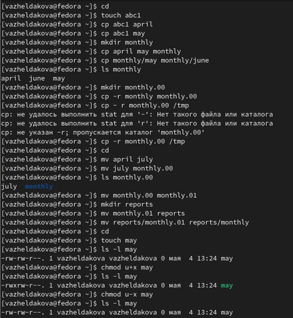{ #fig:001 width=70% }

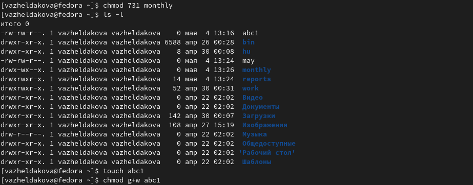{ #fig:002 width=70% }

Затем мы скопировали файл /usr/include/sys/io.h в домашний каталог и назвали его equipment. В домашнем каталоге создали директорию ~/ski.plases. Переместили файл equipment в каталог ~/ski.plases. Переименовали файл ~/ski.plases/equipment в ~/ski.plases/equiplist (рис. [-@fig:003]).

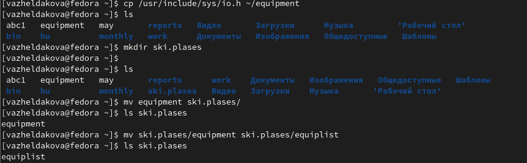{ #fig:003 width=70% }

Создали в домашнем каталоге файл abc1 и скопировали его в каталог ~/ski.plases и назвали equiplist2. Создали каталог с именем equipment в каталоге ~/ski.plases. Переместили файлы ~/ski.plases/equiplist и equiplist2 в каталог ~/ski.plases/equipment (рис. [-@fig:004]).

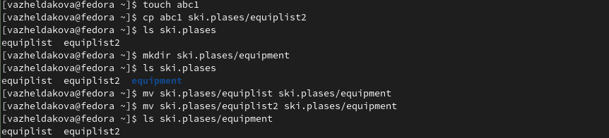{ #fig:004 width=70% }

Создали и переместили каталог ~/newdir в каталог ~/ski.plases и назвали его plans (здесь я случайно использовала не совсем верную команду, необходимо было использовать mv) (рис. [-@fig:005]).

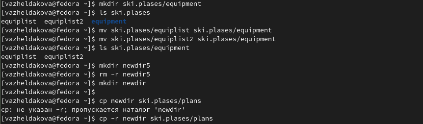{ #fig:005 width=70% }

Создали два каталога (australia, play) и два файла (my_os, feathers). Изменили их права доступа на следующие: (drwxr--r--) australia, (drwx--x--x) play, (-r-xr--r--) my_os, (-rw-rw-r--) feathers (рис. [-@fig:006]).

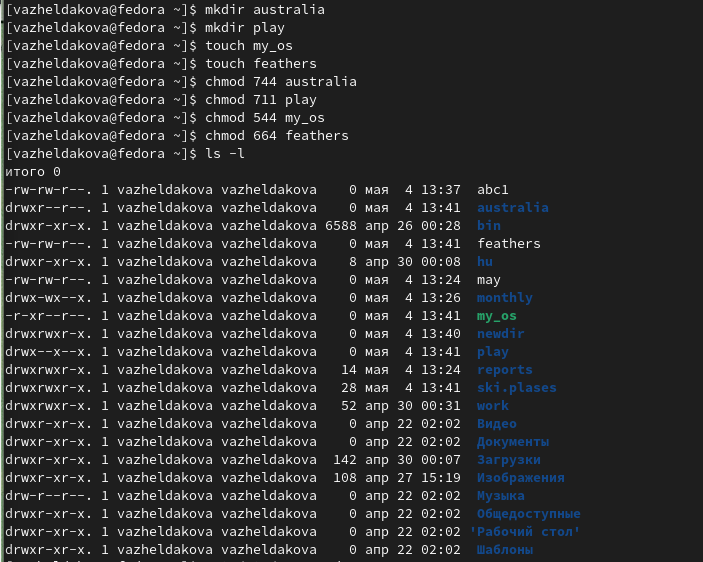{ #fig:006 width=70% }

Просмотрели содержимое файла /etc/passwd с помощью команды cat (рис. [-@fig:007]).

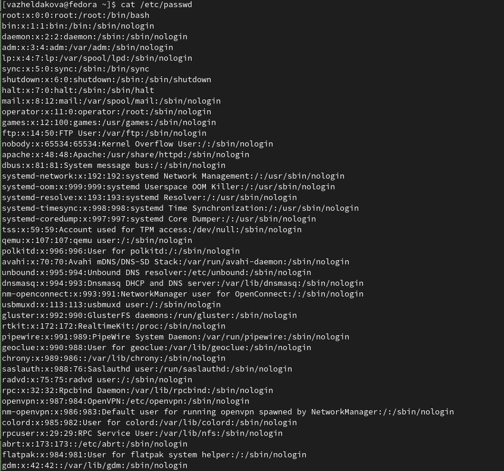{ #fig:007 width=70% }

Скопировали файл ~/feathers в файл ~/file.old, переместили его в каталог play. Скопировали этот каталог в каталог fun. Переместили его в каталог ~/play и назвали games. Лишили владельца файла ~/feathers права на чтение. Попытались просмотреть файл и скопирвать его в другой, но получили ошибку "отказано в доступе". Вернули владельцу право на чтение (рис. [-@fig:008]).

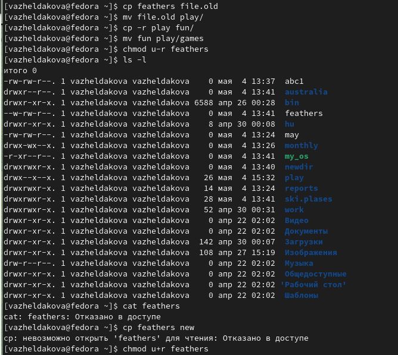{ #fig:008 width=70% }

Проверили прав доступа к каталогу play и лишили владельца права на выполнение (рис. [-@fig:009]).

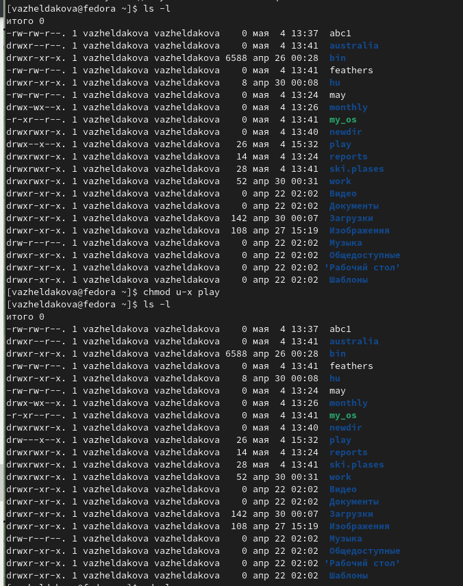{ #fig:009 width=70% }

Попробовали перейти в каталог play, но получили ошибку "отказано в доступе". Вернули права на выполнение (рис. [-@fig:010]).

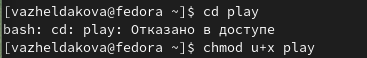{ #fig:010 width=70% }

Прочитали manual по командам и кратко их охарактеризовали.

Команда mount используется для монтирования файловых систем (рис. [-@fig:011]).

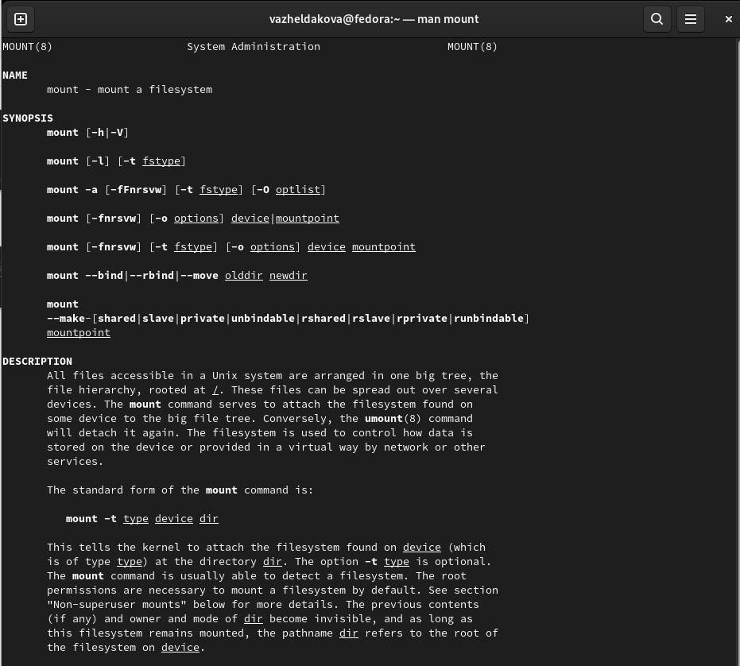{ #fig:011 width=70% }

Команда fsck используется для проверки и восстановления файловой системы (рис. [-@fig:012]).

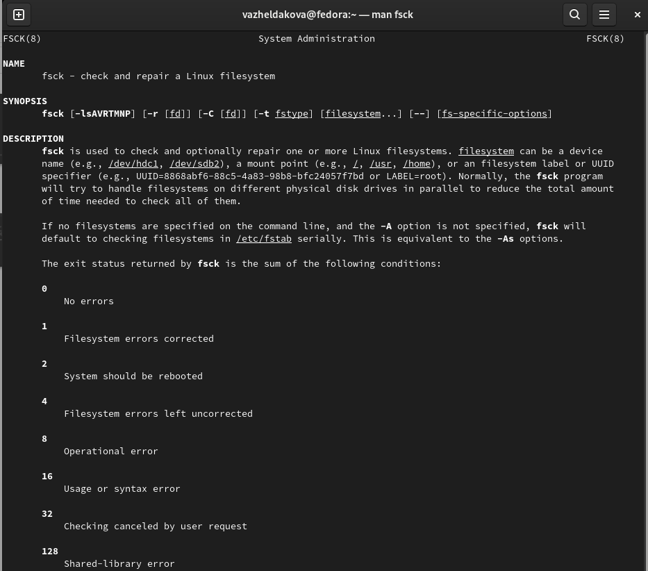{ #fig:012 width=70% }

Команда mkfs используется для создания файловых систем (рис. [-@fig:013]).

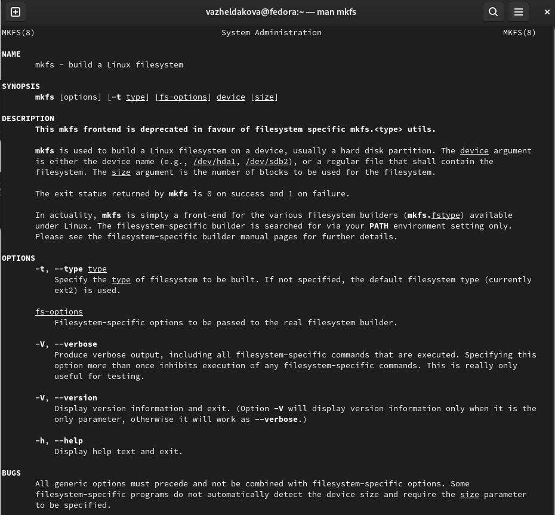{ #fig:013 width=70% }

Команда kill используется для завершения процесса (рис. [-@fig:014]).

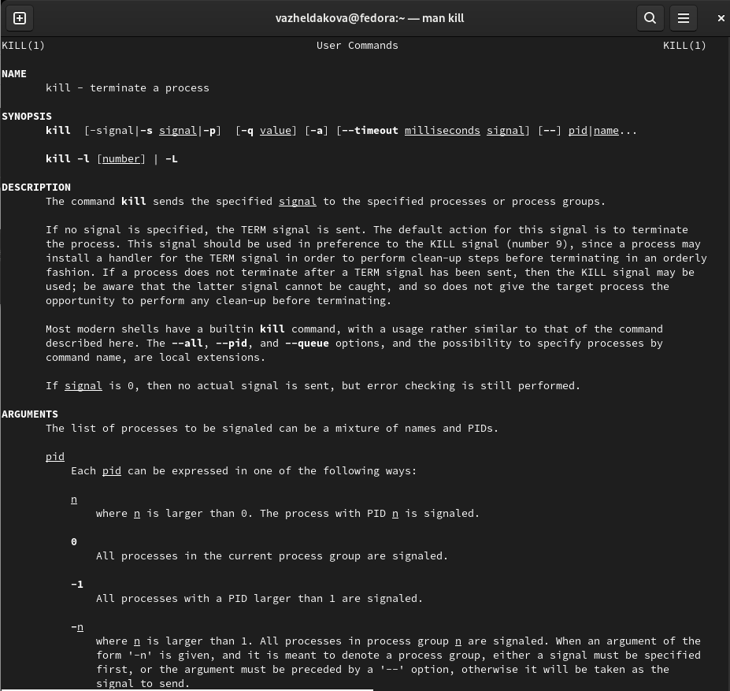{ #fig:014 width=70% }

# Выводы

Ознакомились с файловой системой Linux, её структурой, именами и содержанием каталогов. Приобрели практические навыки по применению команд для работы с файлами и каталогами, по управлению процессами (и работами), по проверке использования диска и обслуживанию файловой системы.

# Контрольные вопросы

1. Дайте характеристику каждой файловой системе, существующей на жёстком диске компьютера, на котором вы выполняли лабораторную работу.

NTFS обеспечивает комбинацию эффективности, надежности и совместимости, отсутствующую в FAT или HPFS. Она разработана для быстрого выполнения стандартных файловых операций типа чтения, записи и поиска, а также улучшенных операций типа восстановления файловой системы на очень больших жестких дисках. NTFS также включает возможности безопасности, требуемые для файловых серверов и высококачественных персональных компьютеров в корпоративной среде. NTFS поддерживает управление доступом к данным и привилегии владельца, что является важным для целостности корпоративных данных. В то время как каталогам, разделяемым при помощи Windows NT Server, назначаются специфические разрешения, файлам и каталогам NTFS могут назначаться разрешения вне зависимости, разделены они или нет. NTFS — единственная файловая система в Windows NT, которая позволяет назначить разрешения для отдельных файлов. NTFS является простой, но очень мощной разработкой. Для этой перспективной файловой системы вся информация на томе NTFS является файлом или частью файла. Каждый распределенный на томе NTFS сектор принадлежит некоторому файлу. Даже метаданные (metadata) файловой системы (информация, которая описывает непосредственно файловую систему) являются частью файла. Эта основанная на атрибутах файловая система поддерживает объектно - ориентированные приложения, обрабатывая все файлы как объекты, которые имеют определяемые пользователем и системой атрибуты.

Btrfs — это copy-on-write (копирование при записи (CoW)) файловая система для Linux, предназначенная для реализации расширенных возможностей, в то же время уделяя особое внимание отказоустойчивости, самовосстановлению и простоте администрирования. Использование B-деревьев позволило реализовать метод «копирования при записи», суть которого заключается в использовании общей копии блоков данных при чтении информации. Благодаря такому подходу сильно возрастает производительность файловой системы. В некоторых случаях скорость работы даже выше чем в Ext4. Кроме того, такая структура позволяет делать мгновенные снапшоты файловой системы практически без падения производительности. Структура файловой системы Btrfs в виде B-деревьев позволила разработчикам внести целый ряд современных функций, которых нет, к примеру, в Ext4.

ext4 ­— файловая система, основанная на ext3 и совместимая с ней (только обратно). Основные изменения по сравнению с ext3: увеличение максимального объёма одного раздела диска до 1 эксбибайта (260 байт) при размере блока 4 кибибайт; увеличение размера одного файла до 16 тебибайт (244 байт); введение механизма пространственной (extent) записи файлов, уменьшающего фрагментацию и повышающего производительность. Суть механизма заключается в том, что новая информация добавляется в конец области диска, выделенной заранее по соседству с областью, занятой содержимым файла.

2. Приведите общую структуру файловой системы и дайте характеристику каждой директории первого уровня этой структуры.

Система хранения данных на дисках может быть структурирована следующим образом: Нижний уровень - оборудование. Это в первую очередь магнитные диски с подвижными головками - основные устройства внешней памяти, представляющие собой пакеты магнитных пластин (поверхностей), между которыми на одном рычаге двигается пакет магнитных головок. Шаг движения пакета головок является дискретным, и каждому положению пакета головок логически соответствует цилиндр магнитного диска. Цилиндры делятся на дорожки (треки), а каждая дорожка размечается на одно и то же количество блоков (секторов) таким образом, что в каждый блок можно записать по максимуму одно и то же число байтов. Следовательно, для обмена с магнитным диском на уровне аппаратуры нужно указать номер цилиндра, номер поверхности, номер блока на соответствующей дорожке и число байтов, которое нужно записать или прочитать от начала этого блока. Таким образом, диски могут быть разбиты на блоки фиксированного размера и можно непосредственно получить доступ к любому блоку (организовать прямой доступ к файлам).

Непосредственно с устройствами (дисками) взаимодействует часть ОС, называемая системой ввода-вывода. Система ввода-вывода предоставляет в распоряжение более высокоуровневого компонента ОС - файловой системы - используемое дисковое пространство в виде непрерывной последовательности блоков фиксированного размера. Система ввода-вывода имеет дело с физическими блоками диска, которые характеризуются адресом, например диск 2, цилиндр 75, сектор 11. Файловая система имеет дело с логическими блоками, каждый из которых имеет номер (от 0 или 1 до N). Размер логических блоков файла совпадает или является кратным размеру физического блока диска и может быть задан равным размеру страницы виртуальной памяти, поддерживаемой аппаратурой компьютера совместно с операционной системой.

В структуре системы управления файлами можно выделить базисную подсистему, которая отвечает за выделение дискового пространства конкретным файлам, и более высокоуровневую логическую подсистему, которая использует структуру дерева директорий для предоставления модулю базисной подсистемы необходимой ей информации, исходя из символического имени файла. Она также ответственна за авторизацию доступа к файлам.

Стандартный запрос на открытие или создание файла поступает от прикладной программы к логической подсистеме. Логическая подсистема, используя структуру директорий, проверяет права доступа и вызывает базовую подсистему для получения доступа к блокам файла. После этого файл считается открытым, он содержится в таблице открытых файлов, и прикладная программа получает в свое распоряжение дескриптор этого файла. Дескриптор файла является ссылкой на файл в таблице открытых файлов и используется в запросах прикладной программы на чтение-запись из этого файла. Запись в таблице открытых файлов указывает через систему выделения блоков диска на блоки данного файла. Если к моменту открытия файл уже используется другим процессом, то есть содержится в таблице открытых файлов, то после проверки прав доступа к файлу может быть организован совместный доступ. При этом новому процессу также возвращается дескриптор - ссылка на файл в таблице открытых файлов. Далее в тексте подробно проанализирована работа наиболее важных системных вызовов.

/ — root каталог. Содержит в себе всю иерархию системы;

/bin — здесь находятся двоичные исполняемые файлы. Основные общие команды, хранящиеся отдельно от других программ в системе (прим.: pwd, ls, cat, ps);

/boot — тут расположены файлы, используемые для загрузки системы (образ initrd, ядро vmlinuz);

/dev — в данной директории располагаются файлы устройств (драйверов). С помощью этих файлов можно взаимодействовать с устройствами. К примеру, если это жесткий диск, можно подключить его к файловой системе. В файл принтера же можно написать напрямую и отправить задание на печать;

/etc — в этой директории находятся файлы конфигураций программ. Эти файлы позволяют настраивать системы, сервисы, скрипты системных демонов;

/home — каталог, аналогичный каталогу Users в Windows. Содержит домашние каталоги учетных записей пользователей (кроме root). При создании нового пользователя здесь создается одноименный каталог с аналогичным именем и хранит личные файлы этого пользователя;

/lib — содержит системные библиотеки, с которыми работают программы и модули ядра;

/lost+found — содержит файлы, восстановленные после сбоя работы системы. Система проведет проверку после сбоя и найденные файлы можно будет посмотреть в данном каталоге;

/media — точка монтирования внешних носителей. Например, когда вы вставляете диск в дисковод, он будет автоматически смонтирован в директорию /media/cdrom;

/mnt — точка временного монтирования. Файловые системы подключаемых устройств обычно монтируются в этот каталог для временного использования;

/opt — тут расположены дополнительные (необязательные) приложения. Такие программы обычно не подчиняются принятой иерархии и хранят свои файлы в одном подкаталоге (бинарные, библиотеки, конфигурации);

/proc — содержит файлы, хранящие информацию о запущенных процессах и о состоянии ядра ОС;

/root — директория, которая содержит файлы и личные настройки суперпользователя;

/run — содержит файлы состояния приложений. Например, PID-файлы или UNIX-сокеты;

/sbin — аналогично /bin содержит бинарные файлы. Утилиты нужны для настройки и администрирования системы суперпользователем;

/srv — содержит файлы сервисов, предоставляемых сервером (прим. FTP или Apache HTTP);

/sys — содержит данные непосредственно о системе. Тут можно узнать информацию о ядре, драйверах и устройствах;

/tmp — содержит временные файлы. Данные файлы доступны всем пользователям на чтение и запись. Стоит отметить, что данный каталог очищается при перезагрузке;

/usr — содержит пользовательские приложения и утилиты второго уровня, используемые пользователями, а не системой. Содержимое доступно только для чтения (кроме root). Каталог имеет вторичную иерархию и похож на корневой;

/var — содержит переменные файлы. Имеет подкаталоги, отвечающие за отдельные переменные. Например, логи будут храниться в /var/log, кэш в /var/cache, очереди заданий в /var/spool/ и так далее.

3. Какая операция должна быть выполнена, чтобы содержимое некоторой файловой системы было доступно операционной системе?

Монтирование файловой системы (команда mount). 

4. Назовите основные причины нарушения целостности файловой системы. Как устранить повреждения файловой системы?

Важный аспект надежной работы файловой системы - контроль ее целостности. В результате файловых операций блоки диска могут считываться в память, модифицироваться и затем записываться на диск. Причем многие файловые операции затрагивают сразу несколько объектов файловой системы. Например, копирование файла предполагает выделение ему блоков диска, формирование индексного узла, изменение содержимого каталога и т. д. В течение короткого периода времени между этими шагами информация в файловой системе оказывается несогласованной. И если вследствие непредсказуемой остановки системы на диске будут сохранены изменения только для части этих объектов (нарушена атомарность файловой операции), файловая система на диске может быть оставлена в несовместимом состоянии. В результате могут возникнуть нарушения логики работы с данными, например появиться "потерянные" блоки диска, которые не принадлежат ни одному файлу и в то же время помечены как занятые, или, наоборот, блоки, помеченные как свободные, но в то же время занятые (на них есть ссылка в индексном узле ) или другие нарушения. 
В современных ОС предусмотрены меры, которые позволяют свести к минимуму ущерб от порчи файловой системы и затем полностью или частично восстановить ее целостность. Для восстановление файловой системы в Linux используется консольная утилита под названием fsck.

5. Как создаётся файловая система?

В Linux файловые системы создаются при помощи специальной команды mkfs (или mke2fs, mkreiserfs, и др.), указывая в качестве аргумента конкретное блочное устройство.

6. Дайте характеристику командам для просмотра текстовых файлов.

cat – команда используется для вывода текстовой информации из файла на экран

tac – эта команда используется для вывода на экран информации из файла в обратном порядке.

less – позволяет просматривать файлы любой длины, прокручивая их в любую сторону

7. Приведите основные возможности команды cp в Linux.

Команда сp копирует файлы и директории из одного места в другое.

8. Приведите основные возможности команды mv в Linux.

Команда mv используется для перемещения одного или нескольких файлов (или директорий) в другую директорию, а также для переименования файлов и директорий.

9. Что такое права доступа? Как они могут быть изменены?

Поскольку Linux - многопользовательская OS, в ней существует система прав доступа к файлам, служащая для защиты файлов каждого пользователя от влияния других пользователей системы. Разрешение на чтение позволяет пользователю читать содержимое файлов, а в случае каталогов - просматривать перечень имен файлов в каталоге (используя, например, команду ls). Разрешение на запись позволяет пользователю писать в файл, изменять его или удалять. Для каталогов это дает право cоздавать в каталоге новые файлы и каталоги, или удалять файлы в этом каталоге. Наконец, разрешение на выполнение позволяет пользователю выполнять файлы (как бинарные программы, так и командные файлы). Права доступа могут быть изменены с помощью команды chmod. Однако эта возможность доступна только для владельца файла (или каталога) или пользователя с правами администратора.

