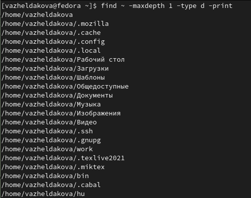

---
## Front matter
title: "Отчёт по лабораторной работе №6"
subtitle: "Поиск файлов. Перенаправление ввода-вывода. Просмотр запущенных процессов."
author: "Желдакова Виктория Алексеевна"

## Generic otions
lang: ru-RU
toc-title: "Содержание"

## Bibliography
bibliography: bib/cite.bib
csl: pandoc/csl/gost-r-7-0-5-2008-numeric.csl

## Pdf output format
toc: true # Table of contents
toc-depth: 2
lof: true # List of figures
lot: true # List of tables
fontsize: 12pt
linestretch: 1.5
papersize: a4
documentclass: scrreprt
## I18n polyglossia
polyglossia-lang:
  name: russian
  options:
	- spelling=modern
	- babelshorthands=true
polyglossia-otherlangs:
  name: english
## I18n babel
babel-lang: russian
babel-otherlangs: english
## Fonts
mainfont: PT Serif
romanfont: PT Serif
sansfont: PT Sans
monofont: PT Mono
mainfontoptions: Ligatures=TeX
romanfontoptions: Ligatures=TeX
sansfontoptions: Ligatures=TeX,Scale=MatchLowercase
monofontoptions: Scale=MatchLowercase,Scale=0.9
## Biblatex
biblatex: true
biblio-style: "gost-numeric"
biblatexoptions:
  - parentracker=true
  - backend=biber
  - hyperref=auto
  - language=auto
  - autolang=other*
  - citestyle=gost-numeric
## Pandoc-crossref LaTeX customization
figureTitle: "Рис."
tableTitle: "Таблица"
listingTitle: "Листинг"
lofTitle: "Список иллюстраций"
lotTitle: "Список таблиц"
lolTitle: "Листинги"
## Misc options
indent: true
header-includes:
  - \usepackage{indentfirst}
  - \usepackage{float} # keep figures where there are in the text
  - \floatplacement{figure}{H} # keep figures where there are in the text
---

# Цель работы

Ознакомление с инструментами поиска файлов и фильтрации текстовых данных. Приобретение практических навыков: по управлению процессами (и заданиями), по проверке использования диска и обслуживанию файловых систем.

# Теоретическое введение

В системе по умолчанию открыто три специальных потока: 

 - stdin — стандартный поток ввода (по умолчанию: клавиатура), файловый дескриптор 0;

 - stdout — стандартный поток вывода (по умолчанию: консоль), файловый дескриптор 1;

 - stderr — стандартный поток вывод сообщений об ошибках (по умолчанию: консоль), файловый дескриптор 2.

Большинство используемых в консоли команд и программ записывают результаты своей работы в стандартный поток вывода stdout. Например, команда ls выводит в стандартный поток вывода (консоль) список файлов в текущей директории. Потоки вывода и ввода можно перенаправлять на другие файлы или устройства. Проще всего это делается с помощью символов >, >>, <, <<.

Конвейер (pipe) служит для объединения простых команд или утилит в цепочки, в которых результат работы предыдущей команды передаётся последующей.

Команда find используется для поиска и отображения на экран имён файлов, соответствующих заданной строке символов.

Команда df показывает размер каждого смонтированного раздела диска.

Команда du показывает число килобайт, используемое каждым файлом или каталогом.

Любую выполняющуюся в консоли команду или внешнюю программу можно запустить в фоновом режиме. Для этого следует в конце имени команды указать знак амперсанда &. 

Любой команде, выполняемой в системе, присваивается идентификатор процесса (process ID). Получить информацию о процессе и управлять им, пользуясь идентификатором процесса, можно из любого окна командного интерпретатора.

Команда ps используется для получения информации о процессах.

# Выполнение лабораторной работы

В первую очередь мы осуществили вход в систему, используя соответствующее имя пользователя (рис. [-@fig:001]).

{ #fig:001 width=70% }

С помощью перенапрвления потока вывода записали в файл file.txt t названия файлов, содержащихся в каталоге /etc и дописали в этот же файл названия файлов, содержащихся в вашем домашнем каталоге (рис. [-@fig:002]).

{ #fig:002 width=70% }

С помощью конвейера передали вывод содержимого файла file.txt фильтру по расширению .conf и перенаправили итоговый вывод в файл conf.txt (рис. [-@fig:003]).

{ #fig:003 width=70% }

Используя команду find, отобразили имена файлов, начинавшихся с с, в домашнем каталоге, а затем для того же результата использовали фильтрацию по выводу названий всех файлов в каталоге (рис. [=@fig:004]).

{ #fig:004 width=70% }

Используя команду find, получили имена файлов, начинавшихся с h, в каталоге /etc и передали этот вывод команде less для постраничного вывода (рис. [-@fig:005] и рис. [-@fig:006]).

{ #fig:005 width=70% }

{ #fig:006 width=70% }

С помощью команды find, нашли файлы имена, которых начинаются с log и перенаправили их вывод в файл logfile (рис.[-@fig:007]) и удалили его с помощью команды rm.

{ #fig:007 width=70% }

Запустили в фоновом режиме редактор gedit, используя апостроф в конце команды. Определили идентификатор процесса с помощью команды ps c конфейером и фильтром grep и командами pgrep и pidof. Завершили процесс gedit с помощью команды kill (рис. [-@fig:008]).

{ #fig:008 width=70% }

С помощью команды man получили подробную информацию о командах df и du и выполнили их (рис. [-@fig:009]).

{ #fig:009 width=70% }

Просмотрели справку по команде find и вывели имена всех директорий, имеющихся в домашнем каталоге (рис. [-@fig:010]). 

{ #fig:010 width=70% }

# Выводы

Ознакомились с инструментами поиска файлов и фильтрации текстовых данных. Приобрели практические навыки: по управлению процессами (и заданиями), по проверке использования диска и обслуживанию файловых систем.

# Контрольные вопросы

1. Какие потоки ввода вывода вы знаете?

 - stdin — стандартный поток ввода (по умолчанию: клавиатура), файловый дескриптор 0;
 
 - stdout — стандартный поток вывода (по умолчанию: консоль), файловый дескриптор 1;
 
 - stderr — стандартный поток вывод сообщений об ошибках (по умолчанию: консоль), файловый дескриптор 2.

2. Объясните разницу между операцией > и >>.

> file - Направить стандартный поток вывода в файл. Если файл не существует, он будет создан, если существовал, то будет перезаписан;

>> file - Направить стандартный поток вывода в файл. Если файл не существует, он будет создан, если существует — данные будут дописаны к нему в конец.

3. Что такое конвейер?

Конвейер служит для объединения простых команд или утилит в цепочки, в которых результат работы предыдущей команды передаётся последующей.

4. Что такое процесс? Чем это понятие отличается от программы?

Программа - это просто набор инструкций. Процесс - это внутренний объект операционной системы, связанный с выполнением программы и обеспечивающий поддержку ее выполнения.

5. Что такое PID и GID?

Любой команде, выполняемой в системе, присваивается идентификатор процесса (PID). GID — идентификационный номер группы пользователей.

6. Что такое задачи и какая команда позволяет ими управлять?

Задачи — это второе название процессов. С помощью команды ps можно получить список запущенных на компьютере задач, а с помощью команды kill - завершить процесс.

7. Найдите информацию об утилитах top и htop. Каковы их функции?

Утилита top позволяет интерактивно просматривать список запущенных процессов Linux. htop ещё более мощная утилита для просмотра запущенных процессов в Linux. Пользоваться ею намного удобнее. Здесь поддерживаются не только горячие клавиши, но и управление мышью. top показывает объем занятой памяти вместе с кэш. htop выдает объём реально занятой памяти без кэша.

8. Назовите и дайте характеристику команде поиска файлов. Приведите примеры использования этой команды.

Команда find используется для поиска и отображения на экран имён файлов, соответствующих заданной строке символов (рис.[-@fig:011]).

{ #fig:011 width=70% }

9. Можно ли по контексту (содержанию) найти файл? Если да, то как?

Да, можно, используя команду grep. Например: grep "Linux" -R /etc/ выведет все строки, содержащие "Linux", в файлах в каталоге etc/ и ниже.

10. Как определить объем свободной памяти на жёстком диске?

Командой df можно определить объём свободной памяти на жёстком диске.

11. Как определить объем вашего домашнего каталога?

С помощью команды du можно определить объём файла или каталога.

12. Как удалить зависший процесс?

Зависший процесс можно удалить командой kill.

::: {#refs}
:::
