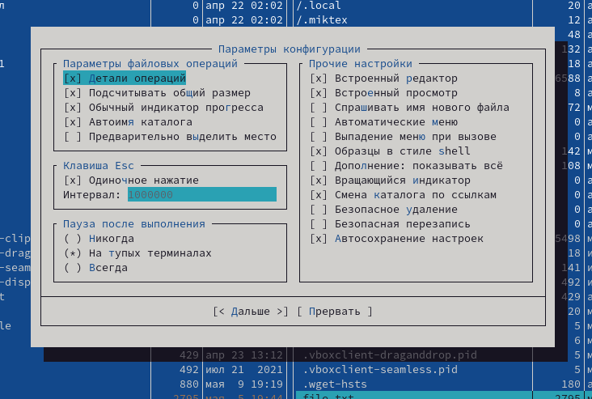

---
## Front matter
title: "Лабораторная работа №7"
subtitle: "Командная оболочка Midnight Commander"
author: "Желдакова Виктория Алексеевна"

## Generic otions
lang: ru-RU
toc-title: "Содержание"

## Bibliography
bibliography: bib/cite.bib
csl: pandoc/csl/gost-r-7-0-5-2008-numeric.csl

## Pdf output format
toc: true # Table of contents
toc-depth: 2
lof: true # List of figures
lot: true # List of tables
fontsize: 12pt
linestretch: 1.5
papersize: a4
documentclass: scrreprt
## I18n polyglossia
polyglossia-lang:
  name: russian
  options:
	- spelling=modern
	- babelshorthands=true
polyglossia-otherlangs:
  name: english
## I18n babel
babel-lang: russian
babel-otherlangs: english
## Fonts
mainfont: PT Serif
romanfont: PT Serif
sansfont: PT Sans
monofont: PT Mono
mainfontoptions: Ligatures=TeX
romanfontoptions: Ligatures=TeX
sansfontoptions: Ligatures=TeX,Scale=MatchLowercase
monofontoptions: Scale=MatchLowercase,Scale=0.9
## Biblatex
biblatex: true
biblio-style: "gost-numeric"
biblatexoptions:
  - parentracker=true
  - backend=biber
  - hyperref=auto
  - language=auto
  - autolang=other*
  - citestyle=gost-numeric
## Pandoc-crossref LaTeX customization
figureTitle: "Рис."
tableTitle: "Таблица"
listingTitle: "Листинг"
lofTitle: "Список иллюстраций"
lotTitle: "Список таблиц"
lolTitle: "Листинги"
## Misc options
indent: true
header-includes:
  - \usepackage{indentfirst}
  - \usepackage{float} # keep figures where there are in the text
  - \floatplacement{figure}{H} # keep figures where there are in the text
---

# Цель работы

Освоение основных возможностей командной оболочки Midnight Commander. Приобретение навыков практической работы по просмотру каталогов и файлов; манипуляций с ними.

# Теоретическое введение

Midnight Commander (MC) — текстовый двухпанельный файловый менеджер для Linux.

MC поддерживает все основные операции с файлами: копирование, перемещение, архивация, изменение прав доступа, создание ссылок, каталогов и другие. MC может работать с файлами на удаленных системах посредством FTP и SSH.

Midnight Commander поддерживает работу с архивами, имеет встроенный быстрый поиск файлов, включая поиск по содержимому файлов.

В Midnight Commander встроен текстовый редактор файлов с подсветкой синтаксиса — MCEdit.

# Выполнение лабораторной работы

## Задание по mc 

Вызвав команду man mc, изучили информацию о программе mc (рис. [-@fig:001])

{ #fig:001 width=70% }

Запустили из командной строки и изучили его структуру и меню. Выполнили несколько операций, используя управляющие клавиши: открыли файл без возможности редактирования на клавишу F3, создали каталог с помощью клавиши F7 и скопировали файл на F5 (рис. [-@fig:002]).

{ #fig:002 width=70% }

Выполнили основные команды меню левой и правой панели: быстрый просмотр, информация (рис. [-@fig:003]) и дерево (рис. [-@fig:004]).

{ #fig:003 width=70% }

{ #fig:004 width=70% }

В режиме Информация в окно выводится информация о подсвеченном в соседнем окне файле и о текущей файловой совокупности. 

Режим Дерево употребляется для отображения полного дерева каталогов в виде иерархической структуры.
 
Режим Быстрый просмотр комфортно использовать для отображения содержимого файла, подсвеченного в соседнем окне.

Используя возможности подменю Файл, выполнили просмотр содержимого с помощью пункта Просмотр (рис. [-@fig:005]), редактирование содержимого с помощью пункта Правка (рис. [-@fig:006]), создание каталога с помощью пункта Создание каталога (рис. [-@fig:007]), копирование файла в созданный каталог с помощью пункта Копирование (рис. [-@fig:008]). 

{ #fig:005 width=70% }

{ #fig:006 width=70% }

{ #fig:007 width=70% }

{ #fig:008 width=70% }

С помощью соответствующих средств подменю Команда осуществили поиск в файловой системе файла с заданными условиями (файла с расширением .c, содержащего строку main) (рис. [-@fig:009]), выбор и повторение одной из предыдущих команд (рис. [-@fig:010]), переход в домашний каталог с помощью дерева каталогов, анализ файла меню и файла расширений (рис. [-@fig:011]) и (рис. [-@fig:012]).

{ #fig:009 width=70% }

{ #fig:010 width=70% }

{ #fig:011 width=70% }

{ #fig:012 width=70% }

Вызвали подменю Настройки и освоили операции, определяющие структуру экрана mc: внешний вид (рис. [-@fig:013]), параметры конфигурации .

{ #fig:013 width=70% }

{ #fig:014 width=70% }

## Задание по встроенному редактору mc

В строке терминала с помощью команды touch создали файл test.txt  (рис. [-@fig:015]). Открыли его с помощью F4 и скопировали в него несколько строк (рис. [-@fig:016]).

{ #fig:015 width=70% }

{ #fig:016 width=70% }

Используя набор клавиш ctrl-y удалили строку, с помощью F3 выделили фрагмент текста и скопировали его на другую строку, переместив курсор и нажав F5. Сохранили файл с помощью команды F2, отменили последнее действие с помощью набора клавиш ctrl-u, перешли в конец файла с помощью ctrl-end и в начало с помощью ctrl-home, в обоих позициях написали некоторый текст. Сохранили файл на F2 и закрыли его.

Открыли файл с расширением .c (рис. [-@fig:017]). Используя подпункт Настройки и Выбор цветовыделения синтаксиса убрали подсветку синтаксиса (рис. [-@fig:018]) и (рис. [-@fig:019]). 

{ #fig:017 width=70% }

{ #fig:018 width=70% }

{ #fig:019 width=70% }

# Выводы

Освоили основные возможности командной оболочки Midnight Commander. Приобрели навыки практической работы по просмотру каталогов и файлов; манипуляций с ними.

# Контрольные вопросы

1. Какие режимы работы есть в mc. Охарактеризуйте их.

В режиме Информация в окно выводится информация о подсвеченном в соседнем окне файле и о текущей файловой совокупности (тип, число и свободное пространство свободных inode). 

Режим Дерево употребляется для отображения полного дерева каталогов в виде иерархической структуры.
 
Режим Быстрый просмотр комфортно использовать для отображения содержимого файла, подсвеченного в соседнем окне.
 
2. Какие операции с файлами можно выполнить как с помощью команд shell, так и с помощью меню (комбинаций клавиш) mc? Приведите несколько примеров.

Копирование файла/каталога можно выполнить с помощью клавиши F5 или с помощью команды cp.

Перемещение файла/каталога можно выполнить с помощью клавиши F6 или с помощью команды mv.

3. Опишите структура меню левой (или правой) панели mc, дайте характеристику командам.
Формат списка: этот пункт меню предназначен для определения формата вывода списка файлов в панели. 

Порядок сортировки: отображение списка файлов в любой из панелей может производиться в соответствии с одним из восьми порядков сортировки: по имени, по расширению; по размеру файла; по времени модификации; по времени последнего обращения к файлу; по времени последнего изменения атрибутов файла; по номеру узла (inode); без сортировки.

Пункт меню "Фильтр" позволяет задать шаблон, которому должны соответствовать имена файлов, отображаемых в панели (например, *.tar.gz). Имена каталогов и ссылки на каталоги отображаются всегда, независимо от шаблона.

4. Опишите структура меню Файл mc, дайте характеристику командам.

Просмотр файла: просмотреть  файл,  на  который  указывает  подсветка.

Просмотр вывода команды: по  этой  команде  на  экране  появляется  строка  ввода, в которой вы можете ввести любую команду с параметрами (по умолчанию предлагается использовать  в  качестве  параметра  имя подсвеченного  файла). Вывод  этой  команды будет отображаться на экране через встроенную программу просмотра.

Правка: вызывается редактор vi, либо редактор,  указанный  в  переменной  окружения  EDITOR,  либо встроенный  редактор  файлов  (если включена опция Встроенный редактор в меню "Настройки /Конфигурация").

Копирование: вызывается  диалоговое  окно,  в  котором  предлагается  скопировать  подсвеченный файл из каталога, отображаемого в активной панели (или группу отмеченных файлов, если  в  активной панели  отмечен  хотя  бы  один  файл)  в  каталог,  отображаемый  в пассивной панели.

Права доступа: позволяет изменить права доступа к выделенному или помеченным файлам.
 
Жесткая ссылка: создаёт жесткую ссылку на текущий файл.

Символическая ссылка: создаёт абсолютную символическую ссылку на текущий файл.

Относительная символическая ссылка: создаёт относительную символическую ссылку на  текущий файл.

Владелец/группа: позволяет выполнить команду chown.

Права (расширенные): позволяет изменить права доступа и владения файлом.

Переименование: вызывается  диалоговое  окно,  в  котором  предлагается  перенести   подсвеченный  файл из каталога,  отображаемого  в активной панели (или группу отмеченных файлов, если в активной панели отмечен хотя бы  один  файл)  в  каталог,  отображаемый  в  пассивной  панели. 

Создание каталога: появляется диалоговое окно и создаётся каталог с введённым именем.

Удаление: удаляется  файл,  имя  которого  подсвечено  (или группа файлов, имена которых помечены) в активной панели. Операцию можно прервать, нажав C-c или Esc во время её исполнения.

Смена каталога: используйте быструю смену каталога если вы знаете полный путь к каталогу, в который хотите перейти (который хотите сделать текущим).

5. Опишите структура меню Команда mc, дайте характеристику командам.

Меню пользователя  предоставляет  простой  способ  расширения возможностей Midnight Commander за счет добавления в личное меню пользователя вызова часто используемых программ.

При обращении к пункту  меню  Дерево  каталогов  выводится  окно,  отображающее  структуру каталогов файловой системы.

Команда  Поиск  файла позволяет найти на диске файл с заданным именем.

Команда Переставить панели меняет местами содержимое правой  и  левой  панелей. 

По  команде Отключить панели показывается вывод последней из выполнявшихся команд оболочки.

По  команде Сравнить каталоги сравнивается содержимое каталогов, отображаемых на левой и правой панелях. 

Пункт меню Внешняя панелизация позволяет выполнить  внешнюю  программу,  сделав  ее  вывод содержимым текущей панели (характерный пример - панелизация вывода команды find).

Пункт  меню  История  командной строки выводит окно со списком ранее выполнявшихся команд.

Пункт меню Каталоги быстрого доступа позволяет создать  список  каталогов,  которые  часто используются, и обеспечить быстрый переход к нужному каталогу из этого списка.

Пункт  меню Список активных ВФС отображает список виртуальных файловых систем, активных на настоящий момент. 

Пункт меню Фоновые  задания  отображает  список  фоновых  заданий,  запущенных  в  диалоге копирования/перемещения кнопкой [В фоне].

Пункт  меню Список экранов отображает диалоговое окно со списком одновременно работающих в данный  момент  встроенноых  редакторов,  программ  просмотра   и   других   модулей   MC, поддерживающих такой режим работы.

После  выбора  пункта  меню  Файл  расширений вы можете связать с определённым расширением файла (окончанием имени после последней точки) программу, которая  будет  запускаться  для обработки  (просмотра,  редактирования  или  выполнения) файла с таким расширением. Запуск выбранной программы будет осуществляться после установки подсветки на имя файла и  нажатия клавиши Enter.

Пункт  меню  Файл  меню  используется  для  редактирования пользовательского меню (которое появляется после нажатия клавиши F2).

6. Опишите структура меню Настройки mc, дайте характеристику командам.

Пункт  Конфигурация  вызывает  диалоговое  окно,  в котором вы можете поменять большинство установок программы Midnight Commander.

Пункт Внешний вид служит для задания настроек, определяющих положение и вид окна программы mc на экране.

Пункт Настройки панелей служит для задания настроек панелей файлового менеджера.

Пункт Подтверждение вызывает диалоговое окно, в котором вы указываете, на выполнение каких действий программа будет требовать подтверждения.

Пункт Оформление вызывает диалоговое окно, в котором вы можете выбрать скин.

Пункт Биты символов вызывает диалоговое окно, в котором вы указываете, в каком формате ваш терминал  будет  обрабатывать (вводить и отображать на дисплее) информацию, представленную (например, записанную в файле).

Пункт Распознавание клавиш вызывает диалоговое окно, в котором  вы  можете  протестировать работу  некоторых  клавиш,  которые  работают  не  на  всех типах терминалов, и связать ту  реакцию системы, которая должна была последовать  за  нажатием  отсутствующей  клавиши,  с нажатием другой клавиши или комбинации клавиш.

Пункт  Виртуальные  ФС  вызывает  диалоговое  окно,  в  котором  вы можете задать значения некоторых параметров, связанных с использованием виртуальных файловых систем.

По команде Сохранить настройки  введённые  значения  параметров  сохраняются  в  ini-файле программы.

7.	Назовите и дайте характеристику встроенным командам mc.

F1 – Help! (помощь, подсказка)

F2 – вызов пользовательского меню

F3 – просмотр содержимого файла

F4 – редактирование содержимого файла (в сочетании с кнопкой «shift» - создание нового файла)

F5 – копирование файла/директории

F6 – перенос или переименование файла/директории

F7 – создание новой директории

F8 – удаление файла/директории

F9 – переход в основное меню Midnight Commander

F10 – выход (завершение работы mc)

TAB, Ctrl+I – переход между панелями

Insert, Ctrl+t – выделение файла/директории для каких либо операций над ними (повторное нажатие на выделенном объекте снимает выделение)

8. Назовите и дайте характеристику командам встроенного редактора mc.

Ctrl-y  удалить строку

Ctrl-u отмена последней операции

Ins вставка/замена

F7 поиск (можно использовать регулярные выражения)

-F7 повтор последней операции поиска

F4 замена

F3 первое нажатие — начало выделения, второе — окончание выделения

F5 копировать выделенный фрагмент

F6 переместить выделенный фрагмент

F8 удалить выделенный фрагмент

F2 записать изменения в файл

F10 выйти из редактора

9.	Дайте характеристику средствам mc, которые позволяют создавать меню, определяемые пользователем.

Меню пользователя – это меню, состоящее из команд, определенных пользователем. При вызове меню используется файл ~/.mc.menu. Если такого файла нет, то по умолчанию используется системный файл меню /usr/lib/mc/mc.menu.

10.	Дайте характеристику средствам mc, которые позволяют выполнять действия, определяемые пользователем, над текущим файлом.

Удаление, просмотр, правка, копирование, перемещение, вывод информации о файле

::: {#refs}
:::
