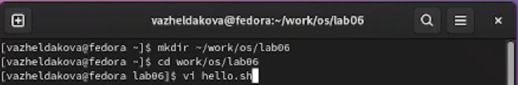

---
## Front matter
title: "Отчёт по лабораторной работе №8"
subtitle: "Текстовой редактор vi"
author: "Желдакова Виктория Алексеевна"

## Generic otions
lang: ru-RU
toc-title: "Содержание"

## Bibliography
bibliography: bib/cite.bib
csl: pandoc/csl/gost-r-7-0-5-2008-numeric.csl

## Pdf output format
toc: true # Table of contents
toc-depth: 2
lof: true # List of figures
lot: true # List of tables
fontsize: 12pt
linestretch: 1.5
papersize: a4
documentclass: scrreprt
## I18n polyglossia
polyglossia-lang:
  name: russian
  options:
	- spelling=modern
	- babelshorthands=true
polyglossia-otherlangs:
  name: english
## I18n babel
babel-lang: russian
babel-otherlangs: english
## Fonts
mainfont: PT Serif
romanfont: PT Serif
sansfont: PT Sans
monofont: PT Mono
mainfontoptions: Ligatures=TeX
romanfontoptions: Ligatures=TeX
sansfontoptions: Ligatures=TeX,Scale=MatchLowercase
monofontoptions: Scale=MatchLowercase,Scale=0.9
## Biblatex
biblatex: true
biblio-style: "gost-numeric"
biblatexoptions:
  - parentracker=true
  - backend=biber
  - hyperref=auto
  - language=auto
  - autolang=other*
  - citestyle=gost-numeric
## Pandoc-crossref LaTeX customization
figureTitle: "Рис."
tableTitle: "Таблица"
listingTitle: "Листинг"
lofTitle: "Список иллюстраций"
lotTitle: "Список таблиц"
lolTitle: "Листинги"
## Misc options
indent: true
header-includes:
  - \usepackage{indentfirst}
  - \usepackage{float} # keep figures where there are in the text
  - \floatplacement{figure}{H} # keep figures where there are in the text
---

# Цель работы

 - Познакомиться с операционной системой Linux. 
 - Получить практические навыки работы с редактором vi, установленным по умолчанию практически во всех дистрибутивах.

# Теоретическое введение

vi — серия текстовых редакторов операционных систем семейства UNIX.

Первая версия была написана Биллом Джоем в 1976 году.

В то время наиболее распространённым был редактор ed. Поскольку он был довольно сложным для «простого смертного», George Coulouris разработал редактор em (англ. editor for mortals — «редактор для смертных»). Билл Джой модифицировал редактор em и назвал его en, а позже на его основе создал ex, в котором появился визуальный режим, вызывавшийся командой vi. Так как пользователи больше времени проводили в визуальном режиме, ex 2.0, ставший частью 2BSD, сразу запускался уже в нём. Так появился vi, бывший в то время всего лишь жёсткой ссылкой на ex.

Редактор писался для терминала ADM-3A, имевшего ограниченную клавиатуру: на ней не было выделенных клавиш-стрелок, а из модификаторов доступны только Shift и частично Ctrl. Эти обстоятельства повлияли на выбор используемых в редакторе клавиш.

# Выполнение лабораторной работы

## Создание нового файла с использованием vi

С помощью команды mkdir создали каталог ~/work/os/lab06, перешли в него, используя cd, вызвали vi и создали новый файл hello.sh (рис. [-@fig:001]).

{ #fig:001 width=70% }

Нажали клавишу i, ввели приведённый в задании текст и перешли в командный режим, используя Esc (рис. [-@fig:002]).

{ #fig:002 width=70% }

Нажали двоеточие, ввели w и q, а затем нажали Enter для сохранения текста и завершения работы (рис. [-@fig:003]).

{ #fig:003 width=70% }

Использовали команду chmod для того, чтобы сделать файл исполняемым (рис. [-@fig:004]).

{ #fig:004 width=70% }

## Редактирование существующего файла

Вызвали vi на редактирование файла (рис. [-@fig:005]).

{ #fig:005 width=70% }

Установили курсор в конец слова HELL, в режиме вставки заменили его на HELLO (рис. [-@fig:006]).

{ #fig:006 width=70% }

Нажали Esc для возврата в командный режим и с помощью команды dw удалили слово local (рис. [-@fig:007]).

{ #fig:007 width=70% }

Вернулись в режим вставки и написали слово LOCAL (рис. [-@fig:008]).

{ #fig:008 width=70% }

Перешли в командный режим, с помощью команды Y скопировали в буфер строку echo $HELLO, а затем вставили её в конец файла, используя P (рис. [-@fig:009]).

{ #fig:009 width=70% }

Используя dd, удалили только что вставленную строку и вернули её обратно с помощью команды u (рис. [-@fig:010] и рис. [-@fig:011]).

{ #fig:010 width=70% }

{ #fig:011 width=70% }

Ввели двоеточие, w и q для записи изменений и выхода из vi (рис. [-@fig:012]).

{ #fig:012 width=70% }

# Выводы

 - Познакомились с операционной системой Linux. 
 - Получили практические навыки работы с редактором vi, установленным по умолчанию практически во всех дистрибутивах.

# Контрольные вопросы

1. Дайте краткую характеристику режимам работы редактора vi.

Командный режим позволяет управлять курсором и вводить команды редактирования. Режим вставки допускает производить ввод текста. При этом текст не будет восприниматься, как команды редактирования. Режим последней строки позволяет производить запись файла на диск и выходить из редактора Vi. Кроме того, используя этот режим, можно вводить дополнительные команды редактирования.

2. Как выйти из редактора, не сохраняя произведённые изменения?

Если необходимо просто выйти Vi (без сохранения выполненных изменений), то необходимо в последней строке набрать символ q.

3. Назовите и дайте краткую характеристику командам позиционирования.

Команды позиционирования: w - перемещает курсор к началу следующего слова; nw - перемещает курсор к началу n-го слова; конец строки не останавливает движение курсора. Он продолжает подсчет слов с начала следующей строки; W - игнорирует все знаки пунктуации и перемещает курсор на следующее после пробела слово; e - перемещает курсор на последний символ в следующем слове; E - перемещает курсор на последний символ в слове. Игнорирует все символы пунктуации за исключением пробела. Слова разделяются пробелами; b - перемещает курсор к первому символу предыдущего слова; nb - перемещает курсор к первому символу n-го предыдущего слова. Команда b не останавливается в начале строки и продолжает движение к началу строки; B - используется подобно команде b, за исключением того, что слова разделяются только символами пробел и новая строка. Она рассматривает все другие символы пунктуации как буквы.

4. Что для редактора vi является словом?

Редактор vi предполагает, что слово - это строка символов, которая может включать в себя буквы, цифры и символы подчеркивания.

5. Каким образом из любого места редактируемого файла перейти в начало (конец)
файла?

0 (ноль) - перейти в начало строки; $ - перейти в конец строки; G - перейти в конец файла; nG - перейти на строку номер n.

6. Назовите и дайте краткую характеристику основным группам команд редактирования.

0 (ноль) - перейти в начало строки; $ - перейти в конец строки; 6. Добавление/вставка текста а- добавить текст после курсора; А - добавить текст в конец строки; i- вставить текст перед курсором; ni- вставить текст n раз; I - вставить текст в началостроки. Вставка строки o - вставить строку под курсором; О - вставить строку над курсором. Удаление текста x- удалить один символ в буфер; dw - удалить одно слово в буфер; d$ - удалить в буфер текст от курсора до конца строки; d0 - (ноль) - удалить в буфер текст от начала строки до позиции курсора; dd - удалить в буфер одну строку; 10dd- удалить в буфер 10 строк. Отмена и повтор произведенных изменений u- отменить последнее изменение; - повторить последнее изменение. Копирование текста в буфер Y- скопировать строку в буфер; nY- скопировать n строк в буфер; yw - скопировать слово в буфер; Вставка текста из буфера p- вставить текст из буфера после курсора; P- вставить текст из буфера перед курсором. Замена текста cw - заменить слово; n cw - заменить n слов; c$ - заменить текст от курсора до конца строки; r - заменить слово; R - заменить текст. Поиск текста / <текст> - произвести поиск вперед по тексту указанной строки символов <текст>; ? <текст> - произвести поиск назад по тексту указанной строки символов <текст>.

7. Необходимо заполнить строку символами $. Каковы ваши действия?

c$ - заменить текст от курсора до конца строки.

8. Как отменить некорректное действие, связанное с процессом редактирования?

u - отменить последнее изменение

9. Назовите и дайте характеристику основным группам команд режима последней строки.

Kопирование и перемещение текста: 

n,m d - уничтожить строки с n по m 

Пример: : 3,8d

i,j m k - переместить строки с i по j , начиная со строки k 

Пример : : 4,9 m 12 

i,j t k- копировать строки с i по j на строку k 

Пример: : 2,5 t 13 

i,j w <имя_файла> - записать строки с i по j в файл с именем <имя_файла> 

Пример: : 5,9 <имя_файла>. 

Запись в файл и выход из редактора:

w - записать измененный текст в файл на диске, не выходя из Vi;

:w <имя_файла> - записать измененный текст в новый файл с именем; 

:w! <имя_файла>- записать измененный текст в файл с именем<имя_файла>;

:wq- записать изменения в файл и выйти из Vi;

:q - выйти из редактора Vi;

:q!- выйти из редактора без записи;

:e!- вернуться в командный режим, отменив все изменения,произведенные со времени последней записи

10. Как определить, не перемещая курсора, позицию, в которой заканчивается строка?

$ - перемещает курсор в конец строки.

11. Выполните анализ опций редактора vi (сколько их, как узнать их назначение и т.д.).

Опции редактора Vi позволяют настроить рабочую среду. Для задания опций используется команда set (в режиме последней строки): : set all - вывести полный список опций; : set nu - вывести номера строк; : set list - вывести невидимые символы; : set ic - не учитывать при поиске, является ли символ прописным или строчным.

12. Как определить режим работы редактора vi?

В режиме вставки внизу окна отображется слово insert, в режиме последней строки - двоеточие, в командном режиме не отображается ничего.

13. Постройте граф взаимосвязи режимов работы редактора vi.

{ width=70% }

::: {#refs}
:::
