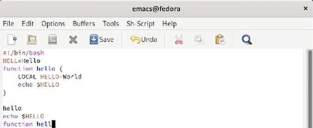

---
## Front matter
title: "Лабораторная работа №9"
subtitle: "Текстовой редактор emacs"
author: "Желдакова Виктория Алексевна"

## Generic otions
lang: ru-RU
toc-title: "Содержание"

## Bibliography
bibliography: bib/cite.bib
csl: pandoc/csl/gost-r-7-0-5-2008-numeric.csl

## Pdf output format
toc: true # Table of contents
toc-depth: 2
lof: true # List of figures
lot: true # List of tables
fontsize: 12pt
linestretch: 1.5
papersize: a4
documentclass: scrreprt
## I18n polyglossia
polyglossia-lang:
  name: russian
  options:
	- spelling=modern
	- babelshorthands=true
polyglossia-otherlangs:
  name: english
## I18n babel
babel-lang: russian
babel-otherlangs: english
## Fonts
mainfont: PT Serif
romanfont: PT Serif
sansfont: PT Sans
monofont: PT Mono
mainfontoptions: Ligatures=TeX
romanfontoptions: Ligatures=TeX
sansfontoptions: Ligatures=TeX,Scale=MatchLowercase
monofontoptions: Scale=MatchLowercase,Scale=0.9
## Biblatex
biblatex: true
biblio-style: "gost-numeric"
biblatexoptions:
  - parentracker=true
  - backend=biber
  - hyperref=auto
  - language=auto
  - autolang=other*
  - citestyle=gost-numeric
## Pandoc-crossref LaTeX customization
figureTitle: "Рис."
tableTitle: "Таблица"
listingTitle: "Листинг"
lofTitle: "Список иллюстраций"
lotTitle: "Список таблиц"
lolTitle: "Листинги"
## Misc options
indent: true
header-includes:
  - \usepackage{indentfirst}
  - \usepackage{float} # keep figures where there are in the text
  - \floatplacement{figure}{H} # keep figures where there are in the text
---

# Цель работы

 - Познакомиться с операционной системой Linux. 
 - Получить практические навыки работы с редактором Emacs.

# Теоретическое введение

Emacs — один из наиболее мощных и широко распространённых редакторов, используемых в мире UNIX. По популярности он соперничает с редактором vi и его клонами.

Разнообразие его функций достигается благодаря архитектуре Emacs, которая позволяет расширять возможности редактора при помощи языка Emacs Lisp. На языке C написаны лишь самые базовые и низкоуровневые части Emacs, включая полнофункциональный интерпретатор языка Lisp. Таким образом, Emacs имеет встроенный язык программирования, который может использоваться для настройки, расширения и изменения поведения редактора. В действительности, большая часть того редактора, с которым пользователи Emacs работают в наши дни, написана на языке Lisp.

Первая версия редактора Emacs была написана в 70-х годах 20-го столетия Richard Stallman как набор макросов для редактора TECO . В дальнейшем, уже будучи основателем Фонда Свободного программного обеспечения Free Software Foundation и проекта GNU, Stallman разработал GNU Emacs в развитие оригинального Emacs и до сих пор сопровождает эту программу. Вы можете подробнее ознакомиться с историей редактора, прочитав статью, располагающуюся по этому адресу.

Emacs является одним из старейших редакторов. Он использовался тысячами программистов на протяжении последних 20 с лишним лет, для него создано много дополнительных пакетов расширений. Эти дополнения позволяют делать с помощью Emacs такие вещи, которые Stallman , вероятно, даже не считал возможными в начале своей работы над редактором. 

# Выполнение лабораторной работы

С помощью командной строки откроем emacs и, введя комбинации C-x C-f, создадим новый файл lab07.sh (рис. [-@fig:001]).

{ #fig:001 width=70% }

Наберём в открывшемся окне данный нам текст (рис. [-@fig:002]).

{ #fig:002 width=70% }

Сохраним файл с помощью комбинации C-x C-s (рис. [-@fig:003]).

{ #fig:003 width=70% }

Используя команду C-k, вырезали целую строку (рис. [-@fig:004]).

{ #fig:004 width=70% }

Перенесём курсор в конец файла и, введя C-y, вставим туда только что вырезанную строку (рис. [-@fig:005]).

{ #fig:005 width=70% }

С помощью C-space выделим фрагмент текста, скопируем его в буфер обмена на M-w и вставим в конец файла (рис. [-@fig:006]).

{ #fig:006 width=70% }

Снова выделим эту область, с помощью C-w вырежем, а с помощью C-/ отменим последнее действие (рис. [-@fig:007] и рис. [-@fig:008]).

{ #fig:007 width=70% }

{ #fig:008 width=70% }

Переместим курсор в начало строки, в конец, в начало буфера и в конец буфера, используя соответственно C-a, C-e, M-<, M-> (рис. [-@fig:009], рис. [-@fig:010], рис. [-@fig:011] и рис. [-@fig:012]).

{ #fig:009 width=70% }

{ #fig:010 width=70% }

{ #fig:011 width=70% }

{ #fig:012 width=70% }

Выведем список активных буферов на экран с помощью C-x C-b (рис. [-@fig:013]).

{ #fig:013 width=70% }

Переместимся на новое окно, используя C-x о, и переключимся на буфер scratch (рис. [-@fig:014]).

{ #fig:014 width=70% }

Закроем новое окно на C-x 0 и переключимся на буфер scratch (рис. [-@fig:015]) и обратно с помощью клавиш C-x b.

{ #fig:015 width=70% }

Поделим окно на два по вертикали с помощью C-x 3 и каждое из них на два по горизонтали с помощью C-x 2 (рис. [-@fig:016]).

{ #fig:016 width=70% }

Откроем в каждом окне новый буфер и введём несколько строк текста. Переключимся в режим поиска на C-s X и попробуем найти несколько слов (рис. [-@fig:017]). Попереключаем результаты поиска с помощью C-s и в конце выйдем из этого режима на C-g.

{ #fig:017 width=70% }

Перейдём в режим поиска и замены, используя M-%, введём текст для поиска и для замены. После подсвечивания результатов нажмём !, чтобы подтвердить замену (рис. [-@fig:018] и рис. [-@fig:019]).

{ #fig:018 width=70% }

{ #fig:019 width=70% }

 Используем другой режим поиска, введя M-s o (рис. [-@fig:020]). 

{ #fig:020 width=70% }

# Выводы

 - Познакомились с операционной системой Linux. 
 - Получили практические навыки работы с редактором Emacs.

# Контрольные вопросы

1. Кратко охарактеризуйте редактор emacs.

Emacs представляет собой мощный экранный редактор текста, написанный на языке высокого уровня Elisp.

2. Какие особенности данного редактора могут сделать его сложным для освоения новичком?

Управление на горячие клавиши, огромное количество разных функций.

3. Своими словами опишите, что такое буфер и окно в терминологии emacs’а.

Буфер соответствует одному редактируемому объекту (результаты компиляции, взаимодействие с пользователем).

Окно - это область экрана, в которой отображается буфер.

4. Можно ли открыть больше 10 буферов в одном окне?

Да, можно.

5. Какие буферы создаются по умолчанию при запуске emacs?

`*scratch*', который может быть использован для вычисления выражений Лиспа в Emacs, и Messages.

6. Какие клавиши вы нажмёте, чтобы ввести следующую комбинацию C-c | и C-c C-|?

Ctrl и c, затем Shift и \

Ctrl и c, затем Ctrl, Shift и \

7. Как поделить текущее окно на две части?

Разделить по горизонтали – C-x 2

Разделить по вертикали – C-x 3

8. В каком файле хранятся настройки редактора emacs?

Для настройки Emacs используется специальный файл, который обычно находится в каталоге пользователя и называется .emacs.

9. Какую функцию выполняет клавиша Backspace и можно ли её переназначить?

С помощью этой клавиши можно стереть символ и её можно переназначить.

10. Какой редактор вам показался удобнее в работе vi или emacs? Поясните почему.

Vi показался удобнее и проще, потому что в Emacs намного больше функций и сложные сочетания клавиш.

::: {#refs}
:::
