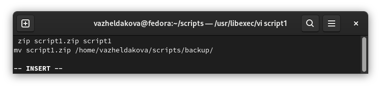
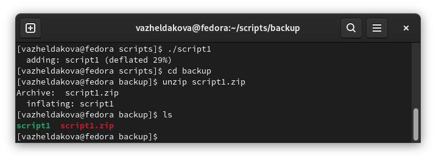
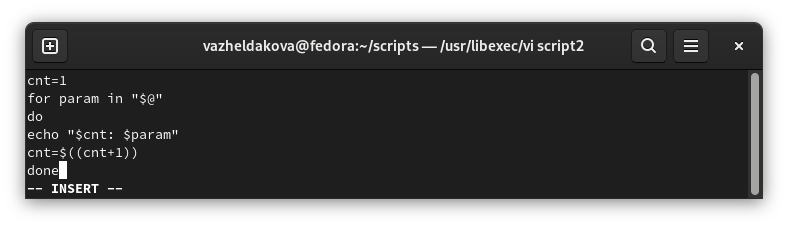
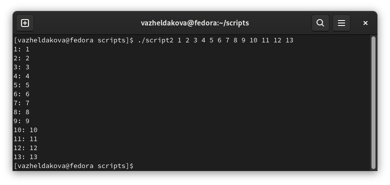
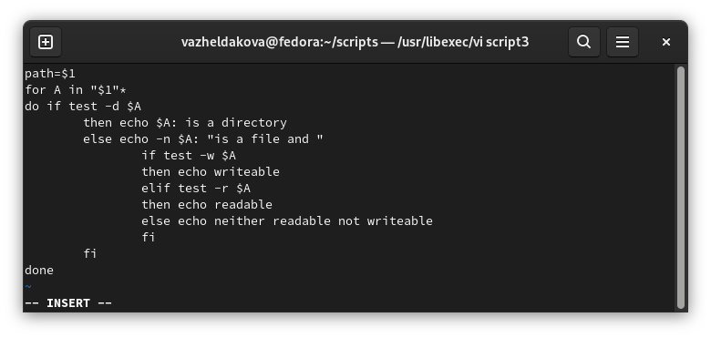
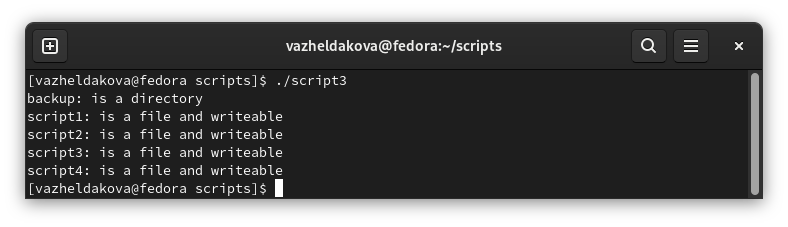
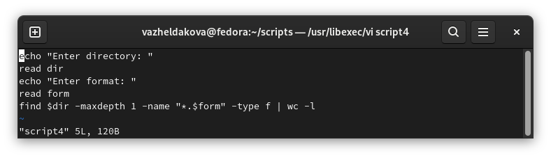
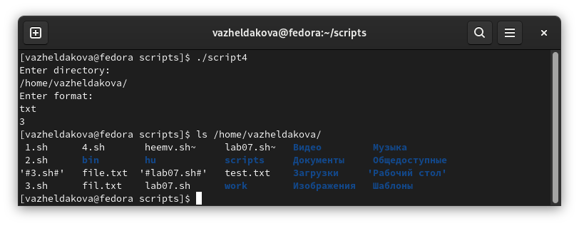

---
## Front matter
lang: ru-RU
title: Лабораторная работа №10
author: Желдакова Виктория Алексеевна
institute: Российский университет дружбы народов
date: 20 мая 2022 г.

## I18n polyglossia
polyglossia-lang:
  name: russian
  options:
	- spelling=modern
	- babelshorthands=true
polyglossia-otherlangs:
  name: english
## I18n babel
babel-lang: russian
babel-otherlangs: english
## Fonts
mainfont: PT Serif
romanfont: PT Serif
sansfont: PT Sans
monofont: PT Mono
mainfontoptions: Ligatures=TeX
romanfontoptions: Ligatures=TeX
sansfontoptions: Ligatures=TeX,Scale=MatchLowercase
monofontoptions: Scale=MatchLowercase,Scale=0.9

## Formatting
toc: false
slide_level: 2
theme: metropolis
header-includes: 
 - \metroset{progressbar=frametitle,sectionpage=progressbar,numbering=fraction}
 - '\makeatletter'
 - '\beamer@ignorenonframefalse'
 - '\makeatother'
aspectratio: 43
section-titles: true
---

# Программирование в командном процессоре ОС UNIX. Командные файлы

## Цель работы

 - Изучить основы программирования в оболочке ОС UNIX/Linux. 
 - Научиться писать небольшие командные файлы.

## Первый скрипт

Написать скрипт, который при запуске будет делать резервную копию самого себя (то есть файла, в котором содержится его исходный код) в другую директорию backup в домашнем каталоге. При этом файл должен архивироваться одним из архиваторов на выбор zip, bzip2 или tar.

{width=70% } 

## Результат работы первого скрипта

{ width=70% }

## Второй скрипт

Написать пример командного файла, обрабатывающего любое произвольное число аргументов командной строки, в том числе превышающее десять.

{width=70% } 

## Результат работы второго скрипта

{ width=70% }

## Третий скрипт

Написать командный файл — аналог команды ls (без использования самой этой команды и команды dir). Требуется, чтобы он выдавал информацию о нужном каталоге и выводил информацию о возможностях доступа к файлам этого каталога.

{width=70% } 

## Результат работы третьего скрипта

{ width=70% }

## Четвёртый скрипт

Написать командный файл, который получает в качестве аргумента командной строки формат файла (.txt, .doc, .jpg, .pdf и т.д.) и вычисляет количество таких файлов в указанной директории. Путь к директории также передаётся в виде аргумента командной строки.

{width=70% } 

## Результат работы четвёртого скрипта

{ width=70% }

## Вывод

 - Изучили основы программирования в оболочке ОС UNIX/Linux. 
 - Научились писать небольшие командные файлы.

