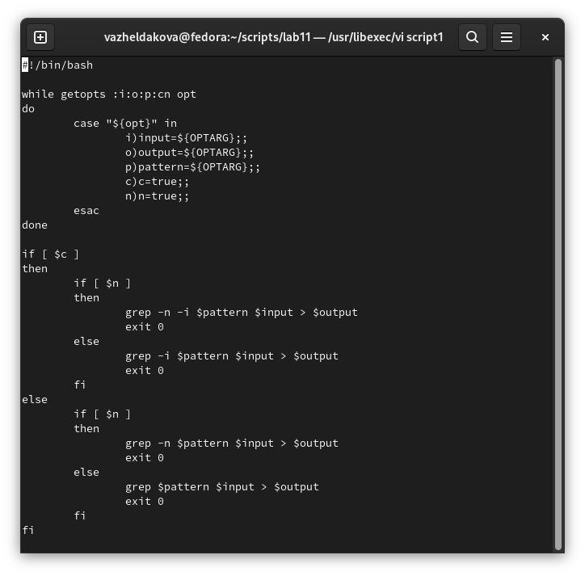
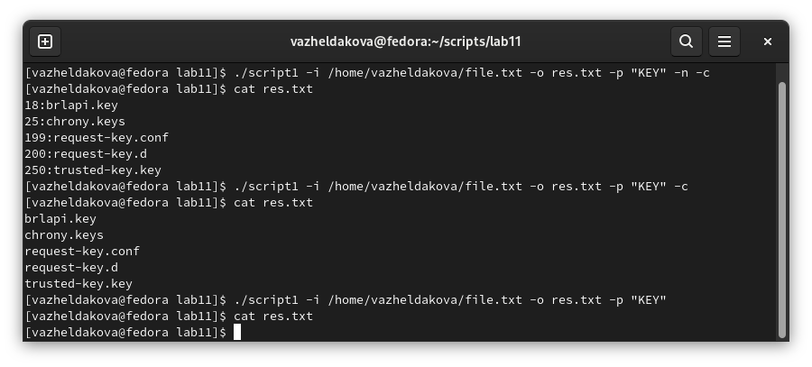
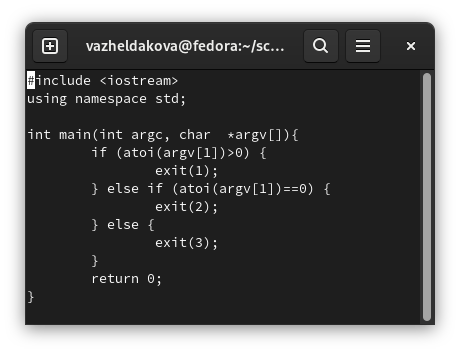
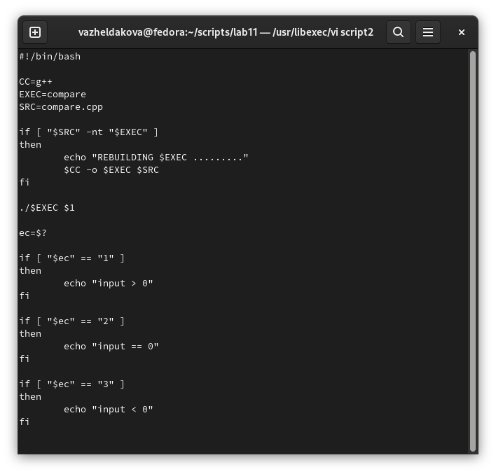
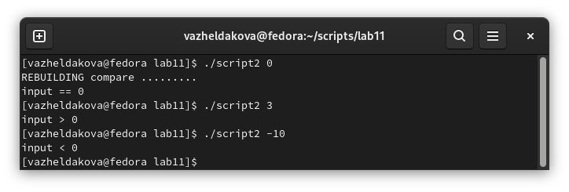
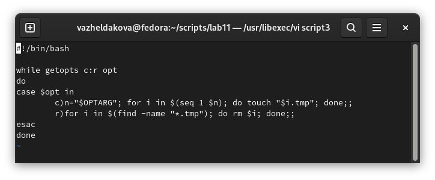
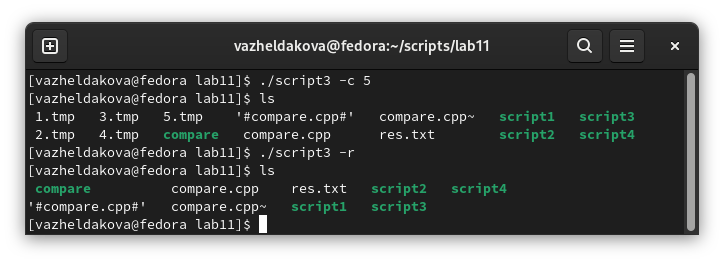
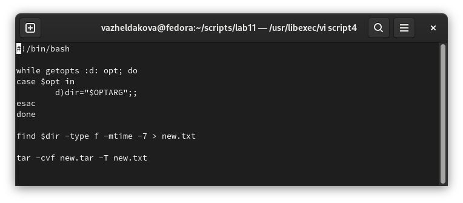
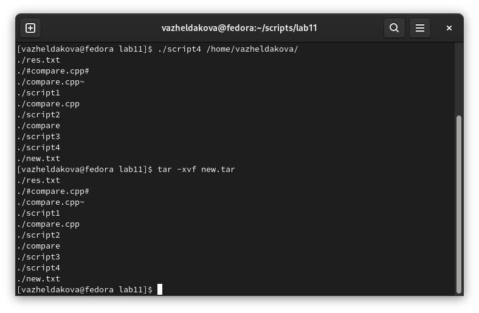

---
## Front matter
lang: ru-RU
title: Лабораторная работа №11
author: Желдакова Виктория Алексеевна
institute: Российский университет дружбы народов
date: 26 мая 2022 г.

## I18n polyglossia
polyglossia-lang:
  name: russian
  options:
	- spelling=modern
	- babelshorthands=true
polyglossia-otherlangs:
  name: english
## I18n babel
babel-lang: russian
babel-otherlangs: english
## Fonts
mainfont: PT Serif
romanfont: PT Serif
sansfont: PT Sans
monofont: PT Mono
mainfontoptions: Ligatures=TeX
romanfontoptions: Ligatures=TeX
sansfontoptions: Ligatures=TeX,Scale=MatchLowercase
monofontoptions: Scale=MatchLowercase,Scale=0.9

## Formatting
toc: false
slide_level: 2
theme: metropolis
header-includes: 
 - \metroset{progressbar=frametitle,sectionpage=progressbar,numbering=fraction}
 - '\makeatletter'
 - '\beamer@ignorenonframefalse'
 - '\makeatother'
aspectratio: 43
section-titles: true
---

# Программирование в командном процессоре ОС UNIX. Ветвления и циклы

## Цель работы

 - Изучить основы программирования в оболочке ОС UNIX. 
 - Научиться писать более сложные командные файлы с использованием логических управляющих конструкций и циклов.

## Первое задание

{ #fig:001 width=70% }

## Первое задание

{ #fig:002 width=70% }

## Второе задание

{ #fig:003 width=70% }

## Второе задание

{ #fig:004 width=70% }

## Второе задание

{ #fig:005 width=70% } 

## Третье задание

{ #fig:006 width=70% }

## Третье задание

{ #fig:007 width=70% }

## Четвёртое задание

{ #fig:008 width=70% }

## Четвёртое задание

{ #fig:009 width=70% }

## Выводы

 - Изучили основы программирования в оболочке ОС UNIX. 
 - Научились писать более сложные командные файлы с использованием логических управляющих конструкций и циклов.

