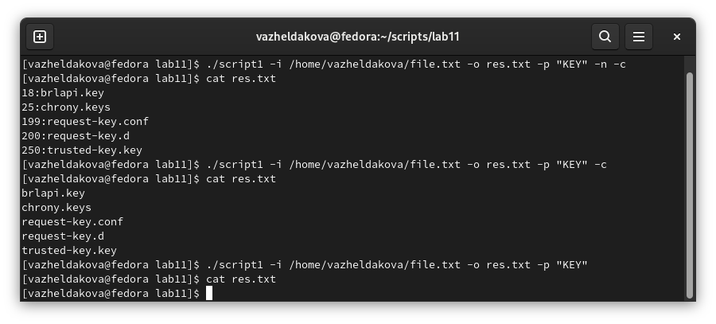
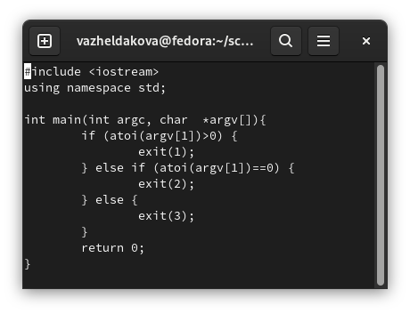
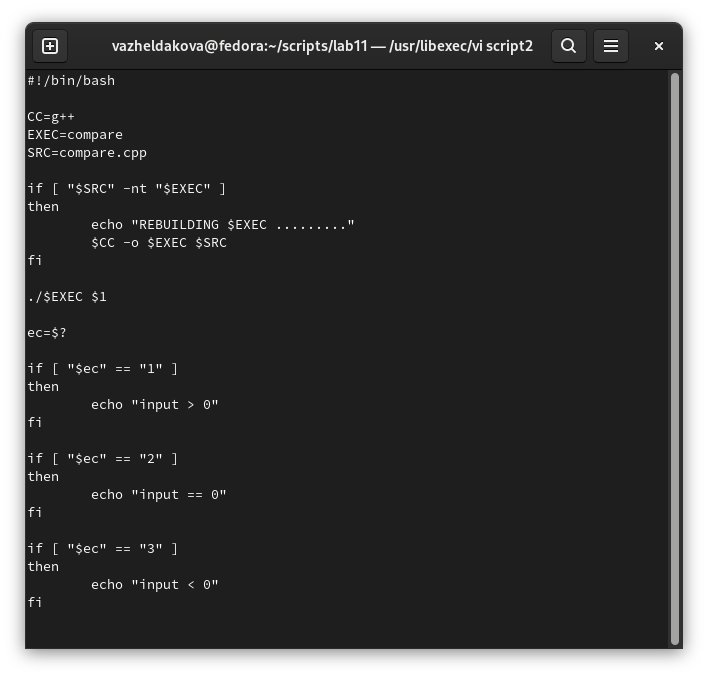
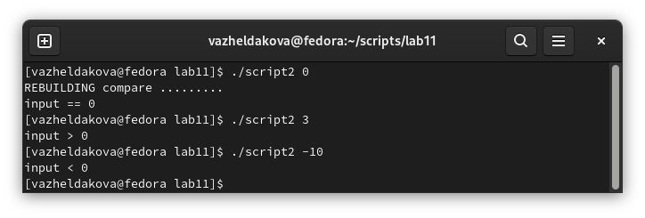
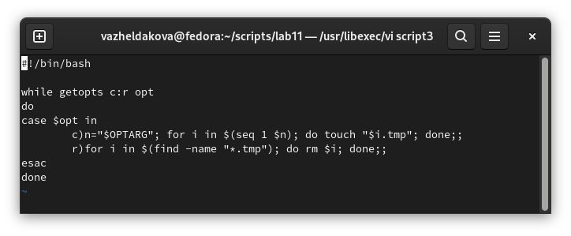
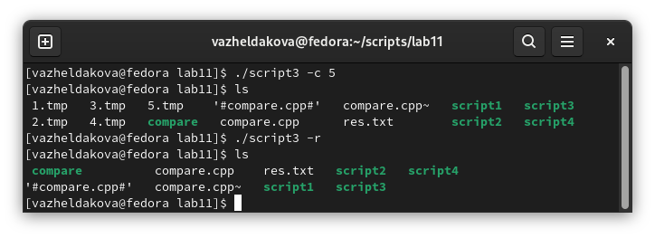
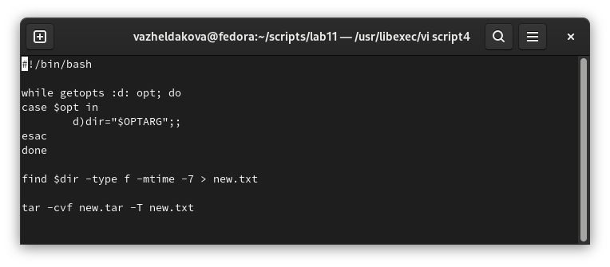
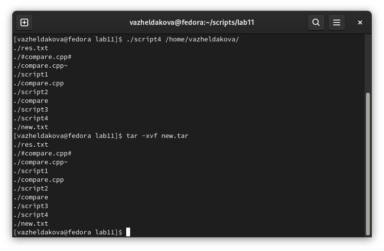

---
## Front matter
title: "Отчёт по лабораторной работе №11"
subtitle: "Программирование в командном процессоре ОС UNIX. Ветвления и циклы"
author: "Желдакова Виктория Алексеевна"

## Generic otions
lang: ru-RU
toc-title: "Содержание"

## Bibliography
bibliography: bib/cite.bib
csl: pandoc/csl/gost-r-7-0-5-2008-numeric.csl

## Pdf output format
toc: true # Table of contents
toc-depth: 2
lof: true # List of figures
lot: true # List of tables
fontsize: 12pt
linestretch: 1.5
papersize: a4
documentclass: scrreprt
## I18n polyglossia
polyglossia-lang:
  name: russian
  options:
	- spelling=modern
	- babelshorthands=true
polyglossia-otherlangs:
  name: english
## I18n babel
babel-lang: russian
babel-otherlangs: english
## Fonts
mainfont: PT Serif
romanfont: PT Serif
sansfont: PT Sans
monofont: PT Mono
mainfontoptions: Ligatures=TeX
romanfontoptions: Ligatures=TeX
sansfontoptions: Ligatures=TeX,Scale=MatchLowercase
monofontoptions: Scale=MatchLowercase,Scale=0.9
## Biblatex
biblatex: true
biblio-style: "gost-numeric"
biblatexoptions:
  - parentracker=true
  - backend=biber
  - hyperref=auto
  - language=auto
  - autolang=other*
  - citestyle=gost-numeric
## Pandoc-crossref LaTeX customization
figureTitle: "Рис."
tableTitle: "Таблица"
listingTitle: "Листинг"
lofTitle: "Список иллюстраций"
lotTitle: "Список таблиц"
lolTitle: "Листинги"
## Misc options
indent: true
header-includes:
  - \usepackage{indentfirst}
  - \usepackage{float} # keep figures where there are in the text
  - \floatplacement{figure}{H} # keep figures where there are in the text
---

# Цель работы

Изучить основы программирования в оболочке ОС UNIX. Научится писать более сложные командные файлы с использованием логических управляющих конструкций и циклов.

# Теоретическое введение

Команда getopts является встроенной командой командной оболочки bash, предназначенной для разбора параметров сценариев. Она обрабатывает исключительно однобуквенные параметры как с аргументами, так и без них и этого вполне достаточно для передачи сценариям любых входных данных.

Базовый синтаксис команды выглядит следующим образом:

$ getopts строка-параметров переменная [набор-параметров]

Строка параметров формируется из принимаемых сценарием однобуквенных параметров с символами двоеточия после тех из них, которые должны использоваться совместно с аргументами (символ двоеточия в начале строки активирует режим сокрытия сообщений об ошибках). Переменная используется для хранения текущего параметра. Набор параметров позволяет осуществлять разбор пользовательского списка параметров вместо параметров сценария (используется достаточно редко). В ходе обработки параметров сценария могут использоваться такие переменные, как переменная $OPTARG, содержащая аргумент текущего параметра, переменная $OPTIND, содержащая номер следующего за текущим параметра и переменная $OPTERR, содержащая значение 0 или 1, указывающее на необходимость вывода сообщений об ошибках при обработке каждого из параметров (перед обработкой каждого из параметров устанавливается значение 1, поэтому вам придется самостоятельно устанавливать значение 0 для сокрытия сообщений об ошибках). Чаще всего обработка параметров осуществляется в рамках цикла while с вложенной конструкцией switch-case, причем в случае необходимости обработки дополнительных аргументов сценариев (например, в случае передачи списка файлов) после цикла используется конструкция shift $(($OPTIND -1)). Команда корректно обрабатывает как отдельно переданные параметры (например, -a -b -c), так и объединенные параметры (например, -abc).

# Выполнение лабораторной работы

## Первое задание 

Используя команду getopts описали флаги для чтения данных из файла, вывод данных в файл, указания шаблона, включение игнорирования регистра букв и нумерации строк. Затем описали параметры поиска и вывода данных в каждом из возможных случаев, используя grep и циклы if-else (рис. [-@fig:001] и рис. [-@fig:002]).

{ #fig:001 width=70% }

{ #fig:002 width=70% }

## Второе задание

Создали файл формата cpp, оформили программу принимающую на вход число. С помощью цикла if-else if-else сделали разный вывод для чисел больше нуля, равных нулю и меньше нуля, а именно exit(1), exit(2), exit(3) (рис. [-@fig:003]).

{ #fig:003 width=70% }

Перешли к оформлению второго скрипта, задали source файл (ранее созданный) и исполняемый. В зависимости от результата работы программы оформили разные сообщения вывода (рис. [-@fig:004] и рис. [-@fig:005]).

{ #fig:004 width=70% }

{ #fig:005 width=70% } 

## Третье задание

Используя команду getopts, описали флаги для создания заданного кол-ва файлов и их удаления. Для создания использовали цикл for от 1 до переданного числа и создали шаблонный файл с каждой итерацией. Для удаления использовали цикл for для найденных файлов, название которых соответствовало бы шаблону (рис. [-@fig:006] и рис. [-@fig:007]).

{ #fig:006 width=70% }

{ #fig:007 width=70% }

## Четвёртое задание

Оформили команду getopts, которой передаётся название директории. С помощью команды find нашли все файлы, которые были изменены не позднее, чем неделю назад и записали их в новый текстовый файл. А затем заахивировали все файлы, перечисленные в нём (рис. [-@fig:008] и рис. [-@fig:008]).

{ #fig:008 width=70% }

{ #fig:009 width=70% }

# Выводы

Изучили основы программирования в оболочке ОС UNIX. Научились писать более сложные командные файлы с использованием логических управляющих конструкций и циклов.

# Контрольные вопросы

1. Каково предназначение команды getopts?

Весьма необходимой при программировании является команда getopts, которая осуществляет синтаксический анализ командной строки, выделяя флаги, и используется для объявления переменных. Синтаксис команды следующий: getopts option-string variable [arg ... ] 

Флаги – это опции командной строки, обычно помеченные знаком минус; Например, -F является флагом для команды ls -F. Иногда эти флаги имеют аргументы, связанные с ними. Программы интерпретируют эти флаги, соответствующим образом изменяя свое поведение. Строка опций option-string — это список возможных букв и чисел соответствующего флага. Если ожидается, что некоторый флаг будет сопровождаться некоторым аргументом, то за этой буквой должно следовать двоеточие. Соответствующей переменной присваивается буква данной опции. Если команда getopts может распознать аргумент, она возвращает истину. Принято включать getopts в цикл while и анализировать введенные данные с помощью оператора case.

2. Какое отношение метасимволы имеют к генерации имён файлов?

При перечислении имен файлов текущего каталога можно использовать следующие символы:

 - * — соответствует произвольной, в том числе и пустой строке;
 - ? — соответствует любому одному символу;
 - [c1-c1] — соответствует любому символу, лексикографически на ходящемуся между символами c1 и с2;
 - echo * — выведет имена всех файлов текущего каталога, что представляет собой простейший аналог команды ls;
 - ls .c — выведет все файлы с последними двумя символами, равными .c;
 - echo prog.? — выдаст все файлы, состоящие из пяти или шести символов, первыми пятью символами которых являются prog;
 - [a-z] — соответствует произвольному имени файла в текущем каталоге, начинающемуся с любой строчной буквы латинского алфавита;

3. Какие операторы управления действиями вы знаете?

 - Точка с запятой (;) Вы можете разместить две и более команд в одной и той же строке, разделив эти команды с помощью символа точки с запятой ;.
 - Амперсанд (&) В том случае, если строка команды оканчивается символом амперсанда &, командная оболочка не будет ожидать завершения исполнения этой команды. Сразу же после ввода команды будет выведено новое приглашение командной оболочки, а сама команда будет исполняться в фоновом режиме. В момент завершения исполнения команды в фоновом режиме вы получите соответствующее сообщение.
 - Cимвол доллара со знаком вопроса ($?) Код завершения предыдущей команды сохраняется в переменной командной оболочки с именем $?.
 - Двойной амперсанд (&&) Командная оболочка будет интерпретировать последовательность символов && как логический оператор "И". При использовании оператора && вторая команда будет исполняться только в том случае, если исполнение первой команды успешно завершится (будет возвращен нулевой код завершения). 
 - Двойная вертикальная черта (||) Оператор || представляет логическую операцию "ИЛИ". Вторая команда исполняется только тогда, когда исполнение первой команды заканчивается неудачей (возвращается ненулевой код завершения).
 - Комбинирование операторов && и || Вы можете использовать описанные логические операторы "И" и "ИЛИ" для создания структур условных переходов в рамках строк команд.
 - Знак фунта (#) Все написанное после символа фунта (#) игнорируется командной оболочкой. Это обстоятельство оказывается полезным при возникновении необходимости в написании комментариев в сценариях командной оболочки, причем комментарии ни коим образом не будут влиять на процесс исполнения команд или процесс раскрытия команд командной оболочкой.
 - Экранирование специальных символов (\) Символ обратного слэша \ позволяет использовать управляющие символы без их интерпретации командной оболочкой; процедура добавления данного символа перед управляющими символами называется экранированием символов.
 
4. Какие операторы используются для прерывания цикла?

Для управления ходом выполнения цикла служат команды break и continue [1] и точно соответствуют своим аналогам в других языках программирования. Команда break прерывает исполнение цикла, в то время как continue передает управление в начало цикло, минуя все последующие команды в теле цикла.

5. Для чего нужны команды false и true?

Команда true всегда возвращает ноль в качестве выходного статуса для индикации успеха.

Команда false всегда возвращает не-ноль в качестве выходного статуса для индикации неудачи.

6. Что означает строка if test -f man$s/$i.$s, встреченная в командном файле?

Веденная строка означает условие существования файла man$s/$i.$s

7. Объясните различия между конструкциями while и until.

Разница между циклом while и until – это условие проверки. Пока выполняется условие проверки, цикл while будет продолжать работать. Однако цикл until будет выполняться только в том случае, если условие ложно.

::: {#refs}
:::
