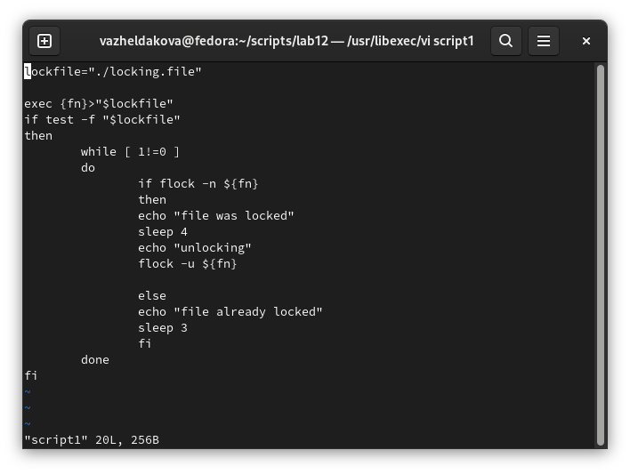
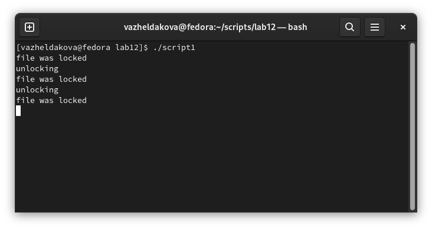
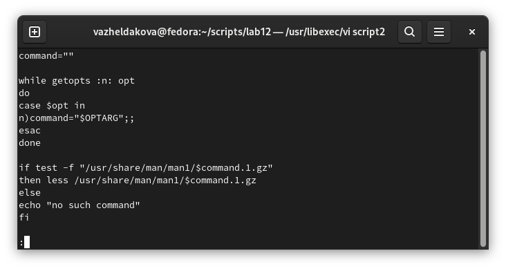
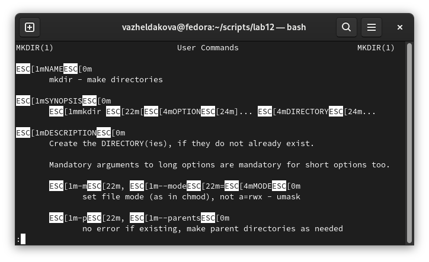
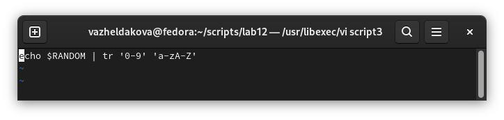
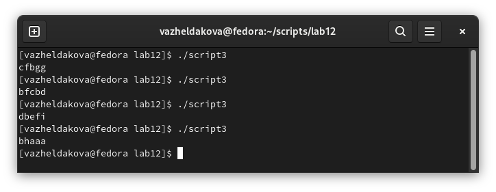

---
## Front matter
lang: ru-RU
title: Лабораторная работа №12
author: Желдакова Виктория Алексеевна
institute: Российсикий университет дружбы народов
date: 28 мая 2022 г.

## I18n polyglossia
polyglossia-lang:
  name: russian
  options:
	- spelling=modern
	- babelshorthands=true
polyglossia-otherlangs:
  name: english
## I18n babel
babel-lang: russian
babel-otherlangs: english
## Fonts
mainfont: PT Serif
romanfont: PT Serif
sansfont: PT Sans
monofont: PT Mono
mainfontoptions: Ligatures=TeX
romanfontoptions: Ligatures=TeX
sansfontoptions: Ligatures=TeX,Scale=MatchLowercase
monofontoptions: Scale=MatchLowercase,Scale=0.9

## Formatting
toc: false
slide_level: 2
theme: metropolis
header-includes: 
 - \metroset{progressbar=frametitle,sectionpage=progressbar,numbering=fraction}
 - '\makeatletter'
 - '\beamer@ignorenonframefalse'
 - '\makeatother'
aspectratio: 43
section-titles: true
---

# Программирование в командном процессоре ОС UNIX. Расширенное программирование

## Цель работы

Изучить основы программирования в оболочке ОС UNIX. Научиться писать более сложные командные файлы с использованием логических управляющих конструкций и циклов.

## Первое задание

Написали командный файл, реализующий упрощённый механизм семафоров. Командный файл должен в течение некоторого времени t1 дожидаться освобождения ресурса, выдавая об этом сообщение, а дождавшись его освобождения, использовать его в течение некоторого времени t2<>t1, также выдавая информацию о том, что ресурс используется соответствующим командным файлом (процессом). Запустили командный файл в одном виртуальном терминале в фоновом режиме, перенаправив его вывод в другой (> /dev/tty#, где # — номер терминала куда перенаправляется вывод), в котором также запущен этот файл, но не фоновом, а в привилегированном режиме. Доработали программу так, чтобы имелась возможность взаимодействия трёх и более процессов (рис. [-@fig:001] и рис. [-@fig:002]).

## Первое задание

{ #fig:001 width=70% }

## Первое задание

{ #fig:002 width=70% }

## Второе задание

Реализовали команду man с помощью командного файла. Изучили содержимое каталога /usr/share/man/man1. В нем находятся архивы текстовых файлов, содержащих справку по большинству установленных в системе программ и команд. Каждый архив можно открыть командой less сразу же просмотрев содержимое справки. Командный файл должен получать в виде аргумента командной строки название команды и в виде результата выдавать справку об этой команде или сообщение об отсутствии справки, если соответствующего файла нет в каталоге man1 (рис. [-@fig:003] и рис. [-@fig:004]).

## Второе задание

{ #fig:003 width=70% }

## Второе задание

{ #fig:004 width=70% }

## Третье задание

Используя встроенную переменную $RANDOM, написали командный файл, генерирующий случайную последовательность букв латинского алфавита. Учли, что $RANDOM выдаёт псевдослучайные числа в диапазоне от 0 до 32767 (рис. [-@fig:005] и рис. [-@fig:006]).

## Третье задание

{ #fig:005 width=70% }

## Третье задание

{ #fig:006 width=70% }

## Выводы

Изучили основы программирования в оболочке ОС UNIX. Научились писать более сложные командные файлы с использованием логических управляющих конструкций и циклов.

