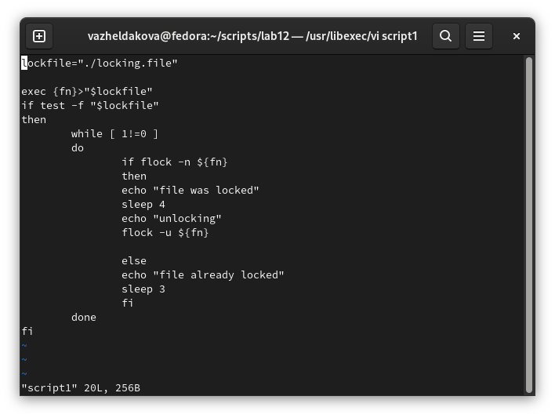
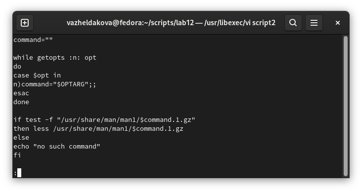
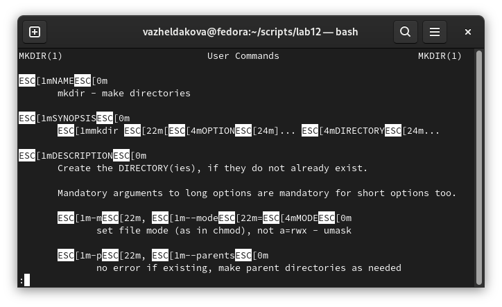
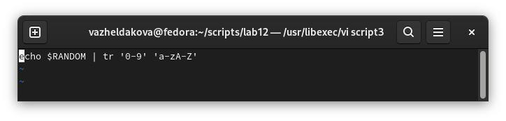
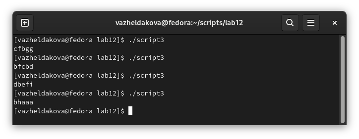

---
## Front matter
title: "Лабораторная работа №12"
subtitle: "Программирование в командном процессоре ОС UNIX. Расширенное программирование"
author: "Желдакова Виктория Алексеевна"

## Generic otions
lang: ru-RU
toc-title: "Содержание"

## Bibliography
bibliography: bib/cite.bib
csl: pandoc/csl/gost-r-7-0-5-2008-numeric.csl

## Pdf output format
toc: true # Table of contents
toc-depth: 2
lof: true # List of figures
lot: true # List of tables
fontsize: 12pt
linestretch: 1.5
papersize: a4
documentclass: scrreprt
## I18n polyglossia
polyglossia-lang:
  name: russian
  options:
	- spelling=modern
	- babelshorthands=true
polyglossia-otherlangs:
  name: english
## I18n babel
babel-lang: russian
babel-otherlangs: english
## Fonts
mainfont: PT Serif
romanfont: PT Serif
sansfont: PT Sans
monofont: PT Mono
mainfontoptions: Ligatures=TeX
romanfontoptions: Ligatures=TeX
sansfontoptions: Ligatures=TeX,Scale=MatchLowercase
monofontoptions: Scale=MatchLowercase,Scale=0.9
## Biblatex
biblatex: true
biblio-style: "gost-numeric"
biblatexoptions:
  - parentracker=true
  - backend=biber
  - hyperref=auto
  - language=auto
  - autolang=other*
  - citestyle=gost-numeric
## Pandoc-crossref LaTeX customization
figureTitle: "Рис."
tableTitle: "Таблица"
listingTitle: "Листинг"
lofTitle: "Список иллюстраций"
lotTitle: "Список таблиц"
lolTitle: "Листинги"
## Misc options
indent: true
header-includes:
  - \usepackage{indentfirst}
  - \usepackage{float} # keep figures where there are in the text
  - \floatplacement{figure}{H} # keep figures where there are in the text
---

# Цель работы

Изучить основы программирования в оболочке ОС UNIX. Научиться писать более сложные командные файлы с использованием логических управляющих конструкций и циклов.

# Теоретическое введение

Bash (от англ. Bourne again shell, каламбур «Born again» shell — «возрождённый» shell) — усовершенствованная и модернизированная вариация командной оболочки Bourne shell. Одна из наиболее популярных современных разновидностей командной оболочки UNIX. Особенно популярна в среде Linux, где она часто используется в качестве предустановленной командной оболочки.

Представляет собой командный процессор, работающий, как правило, в интерактивном режиме в текстовом окне. Bash также может читать команды из файла, который называется скриптом (или сценарием). Как и все Unix-оболочки, он поддерживает автодополнение имён файлов и каталогов, подстановку вывода результата команд, переменные, контроль над порядком выполнения, операторы ветвления и цикла. Ключевые слова, синтаксис и другие основные особенности языка были заимствованы из sh. Другие функции, например, история, были скопированы из csh и ksh. Bash в основном соответствует стандарту POSIX, но с рядом расширений.

Название «bash» является акронимом от англ. Bourne-again-shell («ещё-одна-командная-оболочка-Борна») и представляет собой игру слов: Bourne-shell — одна из популярных разновидностей командной оболочки для UNIX (sh), автором которой является Стивен Борн (1978), усовершенствована в 1987 году Брайаном Фоксом. Фамилия Bourne (Борн) перекликается с английским словом born, означающим «родившийся», отсюда: рождённая-вновь-командная оболочка.

В сентябре 2014 года в bash была обнаружена широко эксплуатируемая уязвимость Bashdoor.

# Выполнение лабораторной работы

Написали командный файл, реализующий упрощённый механизм семафоров. Командный файл должен в течение некоторого времени t1 дожидаться освобождения ресурса, выдавая об этом сообщение, а дождавшись его освобождения, использовать его в течение некоторого времени t2<>t1, также выдавая информацию о том, что ресурс используется соответствующим командным файлом (процессом). Запустили командный файл в одном виртуальном терминале в фоновом режиме, перенаправив его вывод в другой (> /dev/tty#, где # — номер терминала куда перенаправляется вывод), в котором также запущен этот файл, но не фоновом, а в привилегированном режиме. Доработали программу так, чтобы имелась возможность взаимодействия трёх и более процессов (рис. [-@fig:001] и рис. [-@fig:002]).

{ #fig:001 width=70% }

{ #fig:002 width=70% }

Реализовали команду man с помощью командного файла. Изучили содержимое каталога /usr/share/man/man1. В нем находятся архивы текстовых файлов, содержащих справку по большинству установленных в системе программ и команд. Каждый архив можно открыть командой less сразу же просмотрев содержимое справки. Командный файл должен получать в виде аргумента командной строки название команды и в виде результата выдавать справку об этой команде или сообщение об отсутствии справки, если соответствующего файла нет в каталоге man1 (рис. [-@fig:003] и рис. [-@fig:004]).

{ #fig:003 width=70% }

{ #fig:004 width=70% }

Используя встроенную переменную $RANDOM, написали командный файл, генерирующий случайную последовательность букв латинского алфавита. Учли, что $RANDOM выдаёт псевдослучайные числа в диапазоне от 0 до 32767 (рис. [-@fig:005] и рис. [-@fig:006]).

{ #fig:005 width=70% }

{ #fig:006 width=70% }

# Выводы

Изучили основы программирования в оболочке ОС UNIX. Научились писать более сложные командные файлы с использованием логических управляющих конструкций и циклов.

# Контрольные вопросы

1. Найдите синтаксическую ошибку в следующей строке: while [$1 != "exit"]

Между скобками должны быть пробелы, иначе символы в скобках и сами скобки буду восприняты как один элемент.

2. Как объединить (конкатенация) несколько строк в одну?

cat file.txt | xargs | sed -e 's/. /.\\n/g'

3. Найдите информацию об утилите seq. Какими иными способами можно реализовать её функционал при программировании на bash?

Команда seq выводит последовательность целых или действительных чисел, подходящую для передачи в другие программы. Реализовать ее функционал можно командой for n in {1..5} do <КОМАНДА> done

4. Какой результат даст вычисление выражения $((10/3))?

3

5. Укажите кратко основные отличия командной оболочки zsh от bash.

Zsh очень сильно упрощает работу. Но существуют различия. Например, в zsh после for обязательно вставлять пробел, нумерация массивов в zsh начинается с 1. Если вы собираетесь писать скрипт, который будет запускать множество разработчиков, то рекомендуется Bash. Если скрипты вам не нужны - Zsh.

6. Проверьте, верен ли синтаксис данной конструкции for ((a=1; a <= LIMIT; a++))

Верен

7. Сравните язык bash с какими-либо языками программирования. Какие преимущества у bash по сравнению с ними? Какие недостатки?

Очевидно, что Python более удобен для пользователя и, поскольку Python компилируется байтами, он обычно быстрее. Преимущество Bash это его повсеместное распространение. Также Bash позволяет очень легко работать с файловой системой без лишних конструкций (в отличи от обычного языка программирования). Но относительно обычных языков программирования bash очень сжат. Тот же Си имеет гораздо более широкие возможности для разработчика.

::: {#refs}
:::
