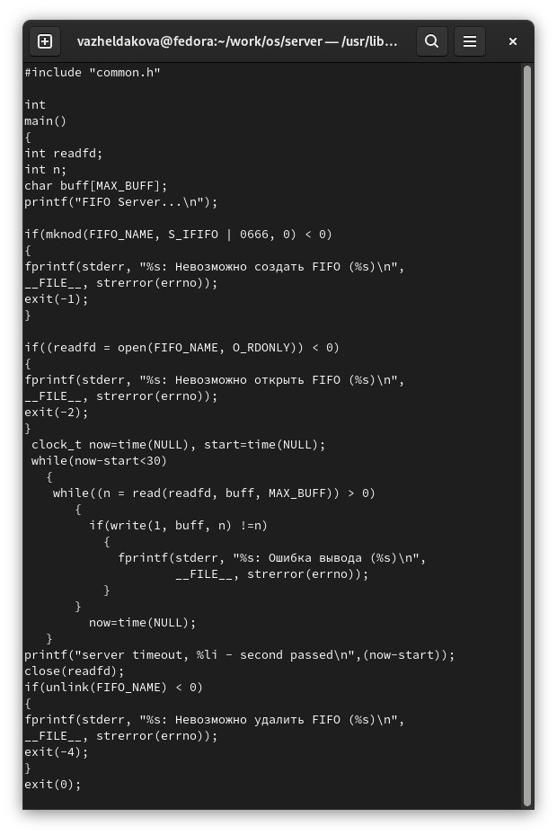
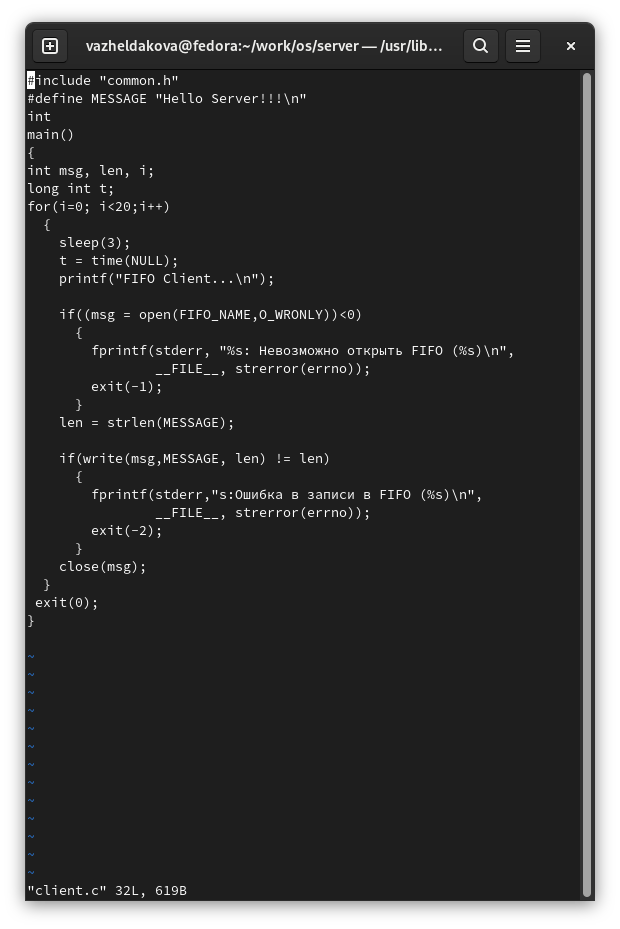
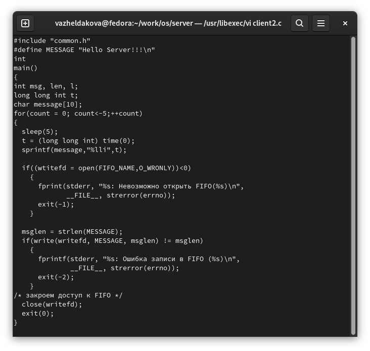
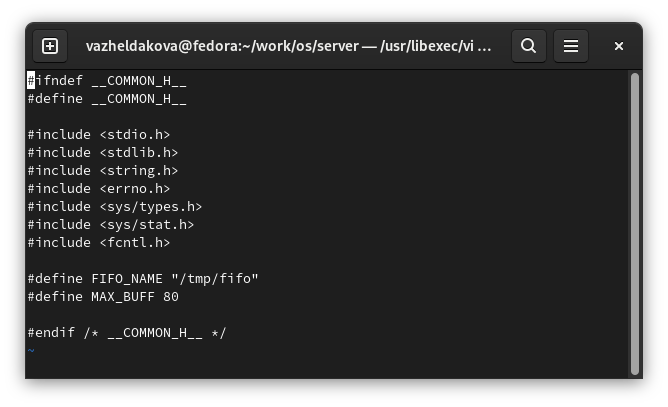
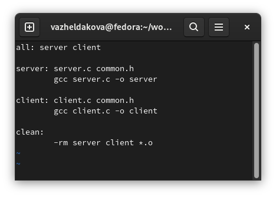
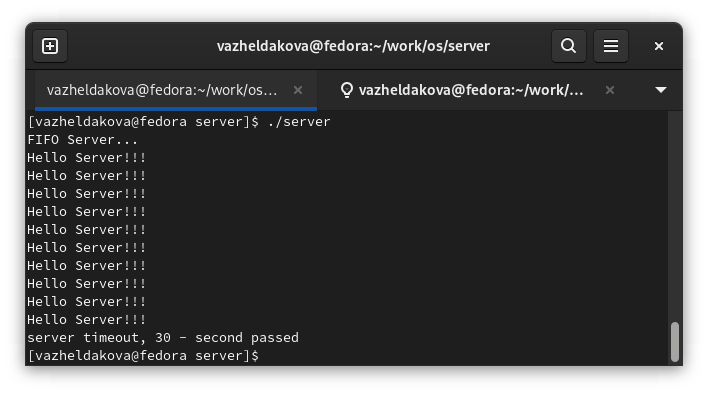

---
## Front matter
lang: ru-RU
title: Лабораторная работа №14
author: Желдакова Виктория Алексеевна
institute: Российский университет дружбы народов
date: 3 июня 2022 г.

## I18n polyglossia
polyglossia-lang:
  name: russian
  options:
	- spelling=modern
	- babelshorthands=true
polyglossia-otherlangs:
  name: english
## I18n babel
babel-lang: russian
babel-otherlangs: english
## Fonts
mainfont: PT Serif
romanfont: PT Serif
sansfont: PT Sans
monofont: PT Mono
mainfontoptions: Ligatures=TeX
romanfontoptions: Ligatures=TeX
sansfontoptions: Ligatures=TeX,Scale=MatchLowercase
monofontoptions: Scale=MatchLowercase,Scale=0.9

## Formatting
toc: false
slide_level: 2
theme: metropolis
header-includes: 
 - \metroset{progressbar=frametitle,sectionpage=progressbar,numbering=fraction}
 - '\makeatletter'
 - '\beamer@ignorenonframefalse'
 - '\makeatother'
aspectratio: 43
section-titles: true
---

# Именованные каналы

## Цель работы

Приобретение практических навыков работы с именованными каналами.

## Выполнение лабораторной работы

Изучите приведённые в тексте программы server.c и client.c. Взяв данные примеры
за образец, напишите аналогичные программы, внеся следующие изменения:

1. Работает не 1 клиент, а несколько (например, два).
2. Клиенты передают текущее время с некоторой периодичностью (например, раз в пять
секунд). Используйте функцию sleep() для приостановки работы клиента.
3. Сервер работает не бесконечно, а прекращает работу через некоторое время (например, 30 сек). Используйте функцию clock() для определения времени работы сервера.

Скопировали содержимое файлов common.h и Makefile из лабораторной работы.

## Выполнение лабораторной работы

{ #fig:001 width=70% }

## Выполнение лабораторной работы

{ #fig:002 width=70% }

## Выполнение лабораторной работы

{ #fig:003 width=70% }

## Выполнение лабораторной работы

{ #fig:004 width=70% }

## Выполнение лабораторной работы

{ #fig:005 width=70% }

## Выполнение лабораторной работы

Запустили make, server в одном окне и client в другом (рис. [-@fig:006])

{ #fig:006 width=70% }

## Выполнение лабораторной работы

Сообщения передевалась с периодичностью в несколько секунд, а по истечении 30 секунд - канал закрылся, и вывелось сообщение об этом.

Что будет в случае, если сервер завершит работу, не закрыв канал?

При завершении программы каналы автоматически закрываются.

## Вывод

Приобретение практических навыков работы с именованными каналами.

