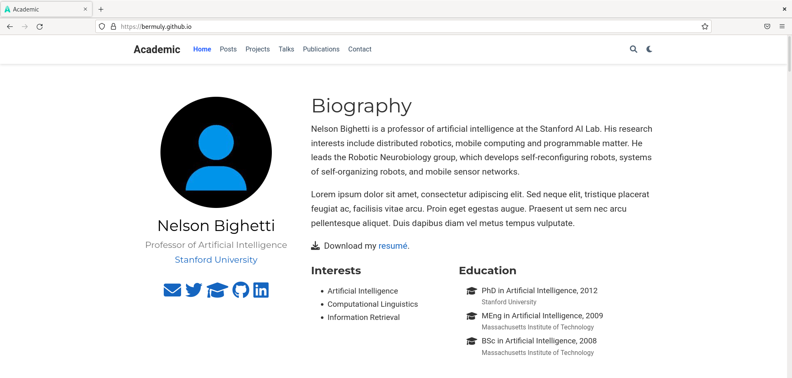

---
## Front matter
lang: ru-RU
title: Индивидуальный проект
subtitle: Этап 1
author: Желдакова Виктория Алексеевна
institute: Российский университет дружбы народов
date: Москва 2022 г.

## I18n polyglossia
polyglossia-lang:
  name: russian
  options:
	- spelling=modern
	- babelshorthands=true
polyglossia-otherlangs:
  name: english
## I18n babel
babel-lang: russian
babel-otherlangs: english
## Fonts
mainfont: PT Serif
romanfont: PT Serif
sansfont: PT Sans
monofont: PT Mono
mainfontoptions: Ligatures=TeX
romanfontoptions: Ligatures=TeX
sansfontoptions: Ligatures=TeX,Scale=MatchLowercase
monofontoptions: Scale=MatchLowercase,Scale=0.9

## Formatting
toc: false
slide_level: 2
theme: metropolis
header-includes: 
 - \metroset{progressbar=frametitle,sectionpage=progressbar,numbering=fraction}
 - '\makeatletter'
 - '\beamer@ignorenonframefalse'
 - '\makeatother'
aspectratio: 43
section-titles: true
---

## Цель работы

Размещение на Github Pages заготовки для персонального сайта.

## Задание

- Установить необходимое программное обеспечение.

- Скачать шаблон темы сайта.

- Разместить его на хостинге git.

- Установить параметр для URLs сайта.

- Разместить заготовку сайта на Github pages.

## Подготовка и размещение шаблона сайта на git 

Перед выполнением работы установили golang и hugo.

Используя шаблон темы сайта создали новый репозиторий под названием blog. Клонировали созданный репозиторий и запустили в нём hugo и hugo server. Получили ссылку на local host. 

## Создание репозитория и размещение сайта на Github Pages

Создали новый репозиторий Github Pages. Клонировали созданный репозиторий в директорию work. Создали новую ветку main. Сохранили текущие изменения, закоммитили их и запушили.

Добавили репозиторий Github Pages как подмодуль в репозиторий blog. Комментированием строки убрали public из .gitignore и повторили предыдущую команду. Запустили hugo ещё раз, сохранили изменения и отправили в центральный репозиторий.

## Результат нашей работы

{ #fig:005 width=70% }

## Вывод

Научились размещать заготовки для персонального сайта на Github Pages.

