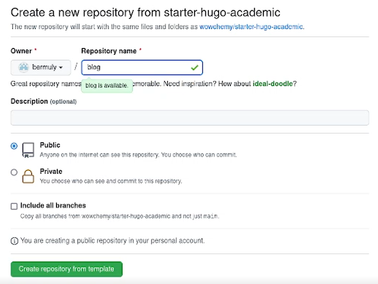
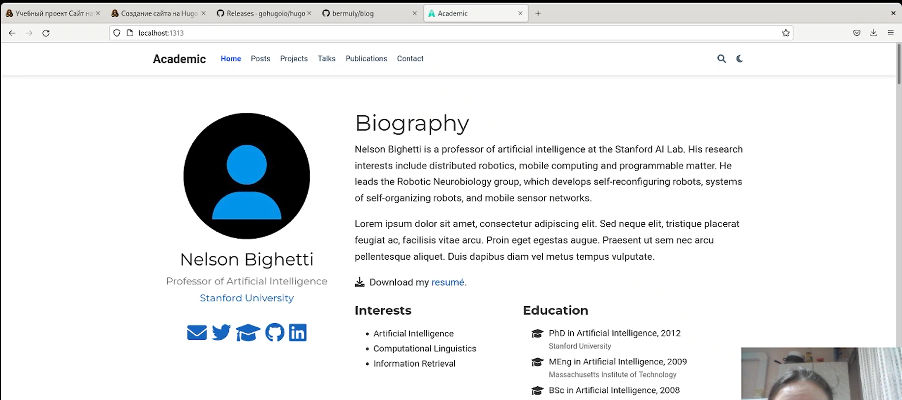
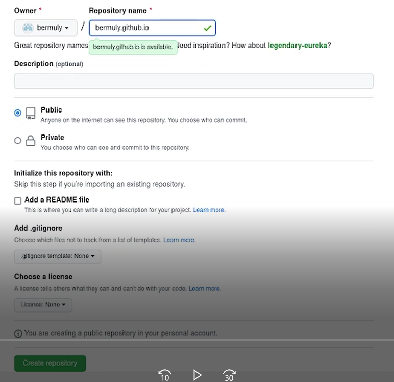
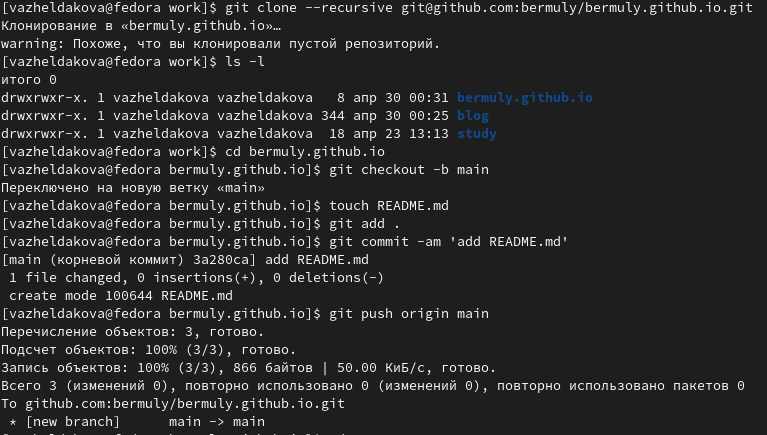
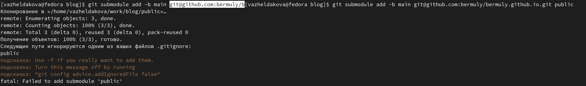
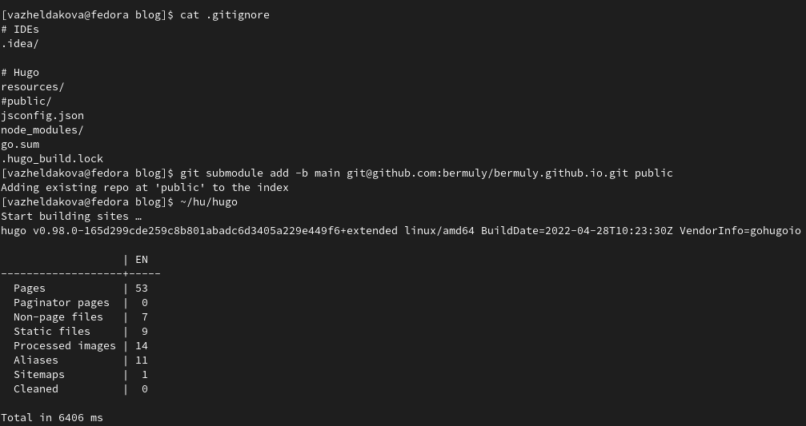

---
## Front matter
title: "Индивидуальный проект"
subtitle: "Этап 1"
author: "Желдакова Виктория Алексеевна"

## Generic otions
lang: ru-RU
toc-title: "Содержание"

## Bibliography
bibliography: bib/cite.bib
csl: pandoc/csl/gost-r-7-0-5-2008-numeric.csl

## Pdf output format
toc: true # Table of contents
toc-depth: 2
lof: true # List of figures
lot: true # List of tables
fontsize: 12pt
linestretch: 1.5
papersize: a4
documentclass: scrreprt
## I18n polyglossia
polyglossia-lang:
  name: russian
  options:
	- spelling=modern
	- babelshorthands=true
polyglossia-otherlangs:
  name: english
## I18n babel
babel-lang: russian
babel-otherlangs: english
## Fonts
mainfont: PT Serif
romanfont: PT Serif
sansfont: PT Sans
monofont: PT Mono
mainfontoptions: Ligatures=TeX
romanfontoptions: Ligatures=TeX
sansfontoptions: Ligatures=TeX,Scale=MatchLowercase
monofontoptions: Scale=MatchLowercase,Scale=0.9
## Biblatex
biblatex: true
biblio-style: "gost-numeric"
biblatexoptions:
  - parentracker=true
  - backend=biber
  - hyperref=auto
  - language=auto
  - autolang=other*
  - citestyle=gost-numeric
## Pandoc-crossref LaTeX customization
figureTitle: "Рис."
tableTitle: "Таблица"
listingTitle: "Листинг"
lofTitle: "Список иллюстраций"
lotTitle: "Список таблиц"
lolTitle: "Листинги"
## Misc options
indent: true
header-includes:
  - \usepackage{indentfirst}
  - \usepackage{float} # keep figures where there are in the text
  - \floatplacement{figure}{H} # keep figures where there are in the text
---

# Цель работы

Размещение на Github Pages заготовки для персонального сайта.

# Задание

- Установить необходимое программное обеспечение.

- Скачать шаблон темы сайта.

- Разместить его на хостинге git.

- Установить параметр для URLs сайта.

- Разместить заготовку сайта на Github pages.

# Теоретическое введение

GitHub Pages — служба хостинга сайтов, которая позволяет вести персональные сайты, сайты организаций и сайты отдельных проектов GitHub.

# Выполнение работы

Перед выполнением работы установили golang и hugo.

Используя шаблон темы сайта создали новый репозиторий под названием blog (рис. [-@fig:001])

{ #fig:001 width=70% }

Клонируем созданный репозиторий и запускаем в нём hugo и hugo server. Получаем ссылку на local host (рис. [-@fig:002]). 

{ #fig:002 width=70% }

Создаем новый репозиторий Github Pages (рис. [-@fig:003]). 

{ #fig:003 width=70% }

Клонируем созданный репозиторий в директорию work. Создаём новую ветку main. Сохраняем текущие изменения, коммитим их и пушим (рис. [-@fig:004]).

{ #fig:004 width=70% }

Добавим репозиторий Github Pages как подмодуль в репозиторий blog (рис. [-@fig:005]). Комментированием строки уберём public из .gitignore и повторим предыдущую команду. Запускаем hugo ещё раз, сохраняем изменения и отправляем в центральный репозиторий (рис. [-@fig:006]). 

{ #fig:005 width=70% }

{ #fig:006 width=70% }

# Выводы

Научились размещать заготовки для персонального сайта на Github Pages.
