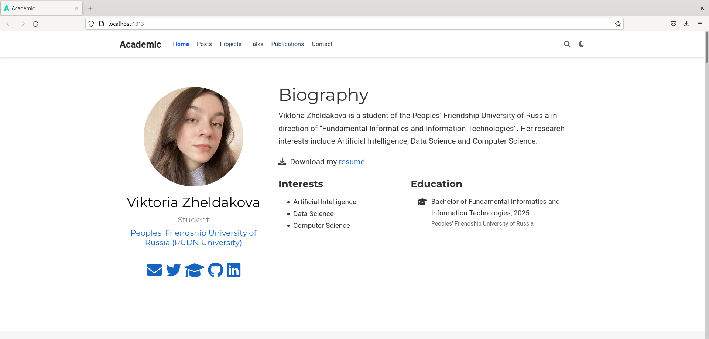

---
## Front matter
lang: ru-RU
title: Индивидуальный проект
author: Желдакова Виктория Алексеевна
institute: Российский университет дружбы народов 
date: 7 мая 2022 г.

## I18n polyglossia
polyglossia-lang:
  name: russian
  options:
	- spelling=modern
	- babelshorthands=true
polyglossia-otherlangs:
  name: english
## I18n babel
babel-lang: russian
babel-otherlangs: english
## Fonts
mainfont: PT Serif
romanfont: PT Serif
sansfont: PT Sans
monofont: PT Mono
mainfontoptions: Ligatures=TeX
romanfontoptions: Ligatures=TeX
sansfontoptions: Ligatures=TeX,Scale=MatchLowercase
monofontoptions: Scale=MatchLowercase,Scale=0.9

## Formatting
toc: false
slide_level: 2
theme: metropolis
header-includes: 
 - \metroset{progressbar=frametitle,sectionpage=progressbar,numbering=fraction}
 - '\makeatletter'
 - '\beamer@ignorenonframefalse'
 - '\makeatother'
aspectratio: 43
section-titles: true
---

# Второй этап

## Цель работы

Добавить к сайту данные о себе:

 - Разместить фотографию владельца сайта.
 - Разместить краткое описание владельца сайта.
 - Добавить информацию об интересах.
 - Добавить информацию от образовании.
 - Сделать пост по прошедшей неделе.
 - Добавить пост на тему по выбору.

## Выполнение

Для добавления своей фотографии на сайт, изменила приведённый шаблон фото на свою фотографию в папке /content/authors/admin/avatar.jpg

Для изменения основных данных о себе перешла в каталог /content/authors/admin в файл _index.md. В сооьвутствующие категории добавила основную информацию о себе: имя, фамилию, позицию, организацию, краткую биографию, интересы, образование и полную биографию.

С помощью команды hugo new post/last-week.md и hugo new post/git.md создали новые файлы для добавления информации в посты о прошедшей неделе и Git.

## Результат

После сохранения всех изменений в файлах, перейдём на нашу страницу сайта и проверим корректнность нашей работы.

{ #fig:001 width=70% }

## Выводы

Добавили к сайту данные о себе:

 - Разместили свою фотографию.
 - Разместить свою биографию.
 - Добавили информацию об интересах.
 - Добавили информацию от образовании.
 - Сделали пост по прошедшей неделе.
 - Добавили пост на тему по выбору.

