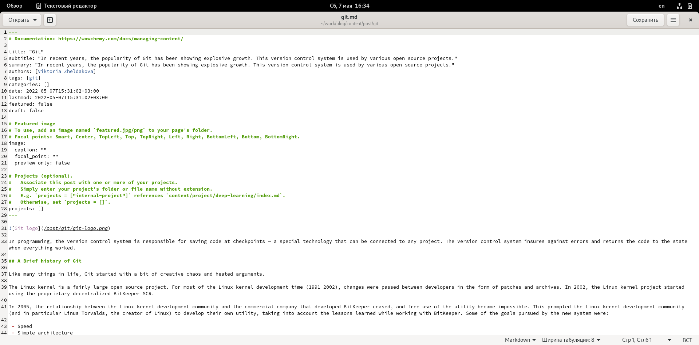

---
## Front matter
title: "Отчёт по индивидуальному проекту"
subtitle: "Второй этап"
author: "Желдакова Виктория Алексеевна"

## Generic otions
lang: ru-RU
toc-title: "Содержание"

## Bibliography
bibliography: bib/cite.bib
csl: pandoc/csl/gost-r-7-0-5-2008-numeric.csl

## Pdf output format
toc: true # Table of contents
toc-depth: 2
lof: true # List of figures
lot: true # List of tables
fontsize: 12pt
linestretch: 1.5
papersize: a4
documentclass: scrreprt
## I18n polyglossia
polyglossia-lang:
  name: russian
  options:
	- spelling=modern
	- babelshorthands=true
polyglossia-otherlangs:
  name: english
## I18n babel
babel-lang: russian
babel-otherlangs: english
## Fonts
mainfont: PT Serif
romanfont: PT Serif
sansfont: PT Sans
monofont: PT Mono
mainfontoptions: Ligatures=TeX
romanfontoptions: Ligatures=TeX
sansfontoptions: Ligatures=TeX,Scale=MatchLowercase
monofontoptions: Scale=MatchLowercase,Scale=0.9
## Biblatex
biblatex: true
biblio-style: "gost-numeric"
biblatexoptions:
  - parentracker=true
  - backend=biber
  - hyperref=auto
  - language=auto
  - autolang=other*
  - citestyle=gost-numeric
## Pandoc-crossref LaTeX customization
figureTitle: "Рис."
tableTitle: "Таблица"
listingTitle: "Листинг"
lofTitle: "Список иллюстраций"
lotTitle: "Список таблиц"
lolTitle: "Листинги"
## Misc options
indent: true
header-includes:
  - \usepackage{indentfirst}
  - \usepackage{float} # keep figures where there are in the text
  - \floatplacement{figure}{H} # keep figures where there are in the text
---

# Цель работы

Добавить к сайту данные о себе:

 - Разместить фотографию владельца сайта.
 - Разместить краткое описание владельца сайта.
 - Добавить информацию об интересах.
 - Добавить информацию от образовании.
 - Сделать пост по прошедшей неделе.
 - Добавить пост на тему по выбору.

# Выполнение лабораторной работы

Для добавления своей фотографии на сайт, изменила приведённый шаблон фото на свою фотографию в папке /content/authors/admin/avatar.jpg (рис. [-@fig:001])

{ #fig:001 width=70% }

Для изменения основных данных о себе перешла в каталог /content/authors/admin в файл _index.md. В категории Display name, role, organizations добавила соотвественно свои имя, фамилию, положение и организацию (рис. [-@fig:002]).

{ #fig:002 width=70% }

В том же файле в категории short bio, interests, education добавили соответственно информацию для пунктов с краткой биографией, интересами и образованием (рис. [-@fig:003]). 

{ #fig:003 width=70% }

В конец файла добавляем полную биографию (рис. [-@fig:004]). 

{ #fig:004 width=70% } 

С помощью команды hugo new post/last-week.md создали новый для изменения информация в посте о прошедшей неделе (рис. [-@fig:005]). 

{ #fig:005 width=70% }

Тем же способом создали новый для поста о Git (рис. [-@fig:006]). 

{ #fig:006 width=70% }

После сохранения всех изменений в файлах, перейдём на нашу страницу сайта и проверим корректнность нашей работы (рис.[-@fig:007] и рис.[-@fig:008]).

{ #fig:007 width=70% }

{ #fig:008 width=70% }

# Выводы

Добавили к сайту данные о себе:

 - Разместили свою фотографию.
 - Разместить свою биографию.
 - Добавили информацию об интересах.
 - Добавили информацию от образовании.
 - Сделали пост по прошедшей неделе.
 - Добавили пост на тему по выбору.

::: {#refs}
:::
