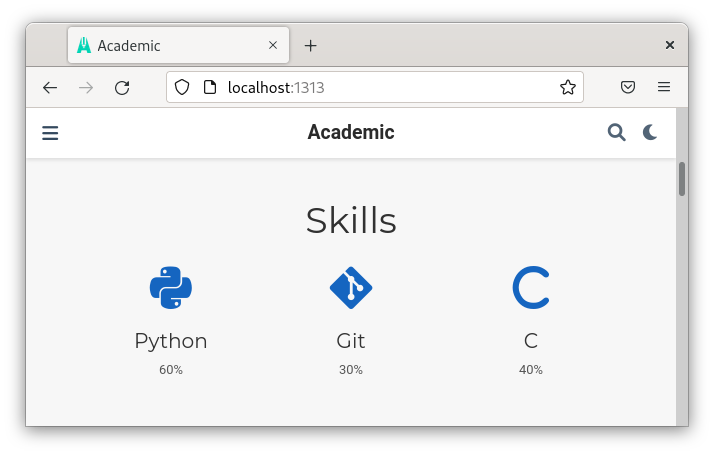
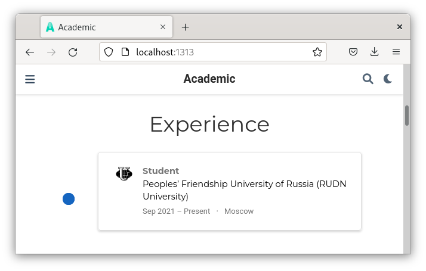
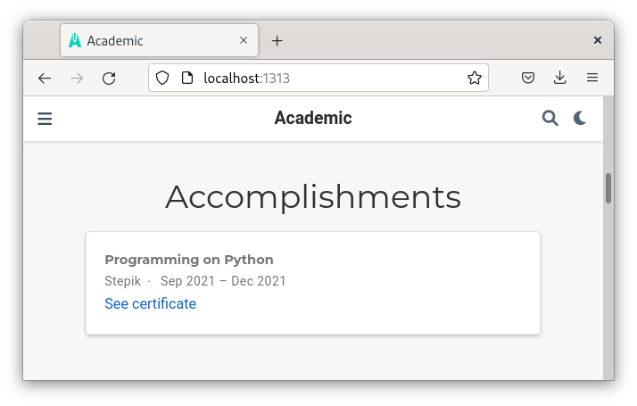
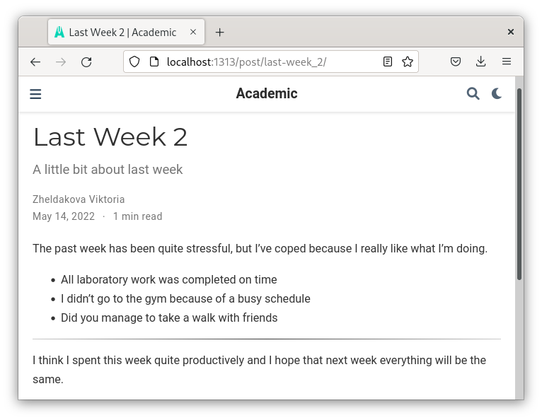
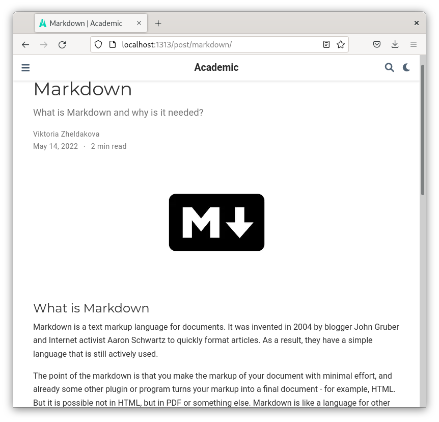

---
## Front matter
lang: ru-RU
title: Индивидуальный проект
author: Желдакова Виктория Алексеевна
institute: Российский университет дружбы народов
date: 14 мая 2022 г.

## I18n polyglossia
polyglossia-lang:
  name: russian
  options:
	- spelling=modern
	- babelshorthands=true
polyglossia-otherlangs:
  name: english
## I18n babel
babel-lang: russian
babel-otherlangs: english
## Fonts
mainfont: PT Serif
romanfont: PT Serif
sansfont: PT Sans
monofont: PT Mono
mainfontoptions: Ligatures=TeX
romanfontoptions: Ligatures=TeX
sansfontoptions: Ligatures=TeX,Scale=MatchLowercase
monofontoptions: Scale=MatchLowercase,Scale=0.9

## Formatting
toc: false
slide_level: 2
theme: metropolis
header-includes: 
 - \metroset{progressbar=frametitle,sectionpage=progressbar,numbering=fraction}
 - '\makeatletter'
 - '\beamer@ignorenonframefalse'
 - '\makeatother'
aspectratio: 43
section-titles: true
---

# Третий этап

## Цель работы

 - Добавить информацию о навыках, опыте и достижениях 
 - Сделать пост по прошедшей неделе
 - Добавить пост на тему Markdown

## Выполнение работы

Для изменения данных о навыках, опыте и достижениях изменяем соответственно файлы skills.md, experience.md, accomplishments.md в каталоге /content/home.

Для начала изменили данные о навыках (рис. [-@fig:002]). 

{ #fig:002 width=70% }

## Выполнение работы

Затем изменили данные об опыте (рис. [-@fig:004]). 

{ #fig:004 width=70% }

## Выполнение работы

Перешли к изменению информации о достижениях (рис. [-@fig:006]). 

{ #fig:006 width=70% }

## Выполнение работы

С помощью команды hugo new post создали две папки для новых постов.

Добавили пост о прошедшей неделе (рис. [-@fig:008]). 

{ #fig:008 width=70% }

## Выполнение работы

Сделали пост на тему Markdown (рис. [-@fig:010]). 

{ #fig:010 width=70% }

## Выводы

 - Научились добавлять информацию о навыках, опыте и достижениях 
 - Сделали пост по прошедшей неделе
 - Добавили пост на тему Markdown

