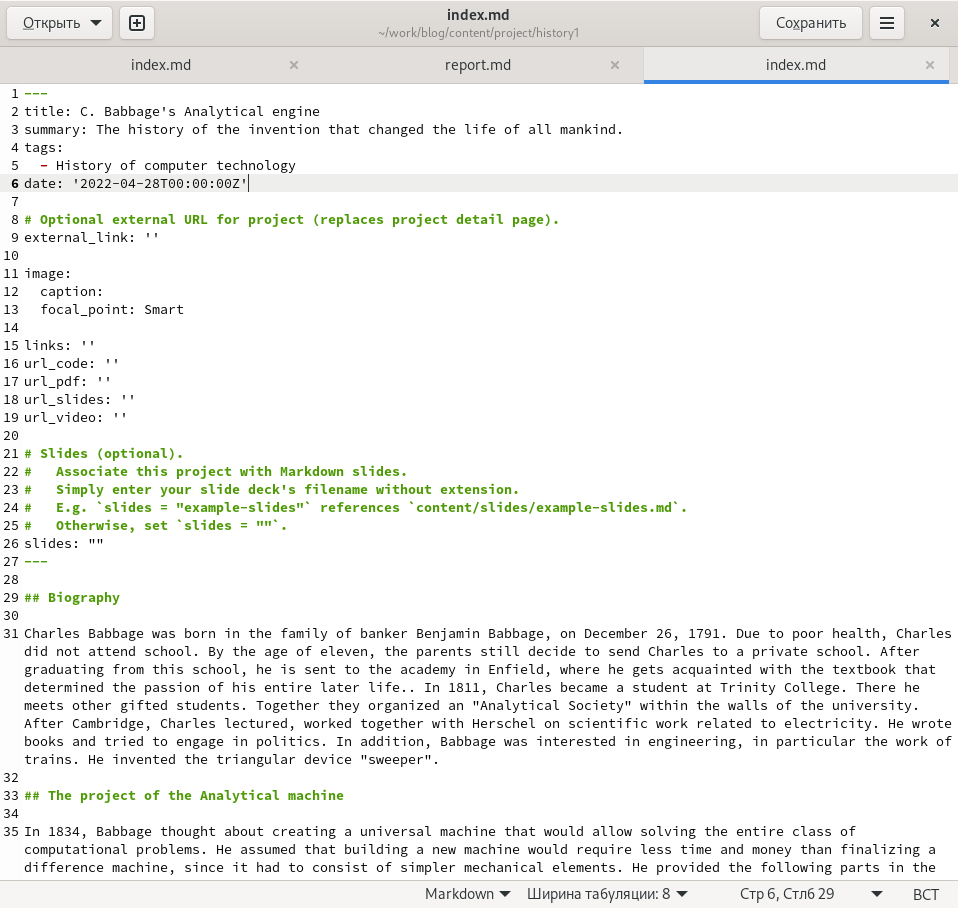
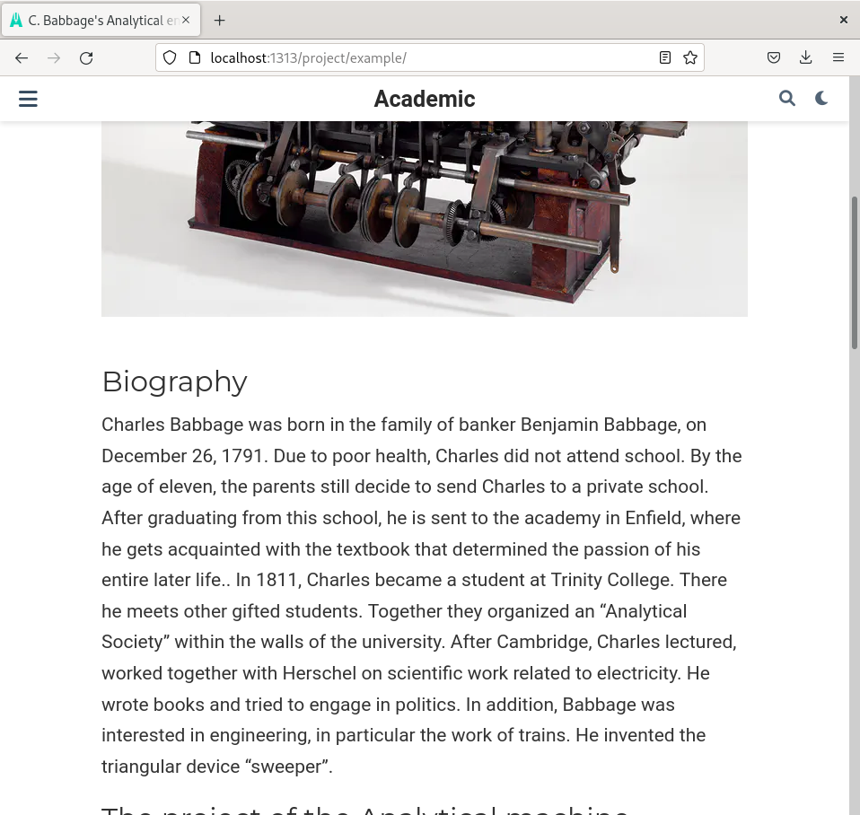
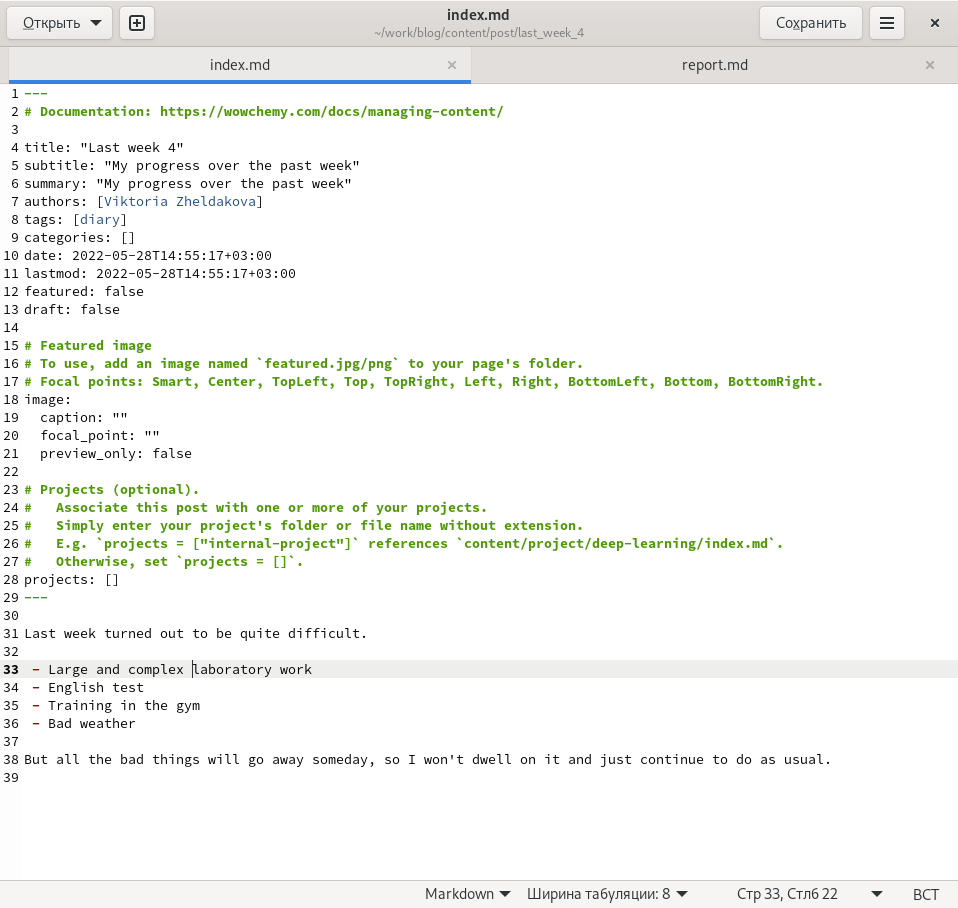
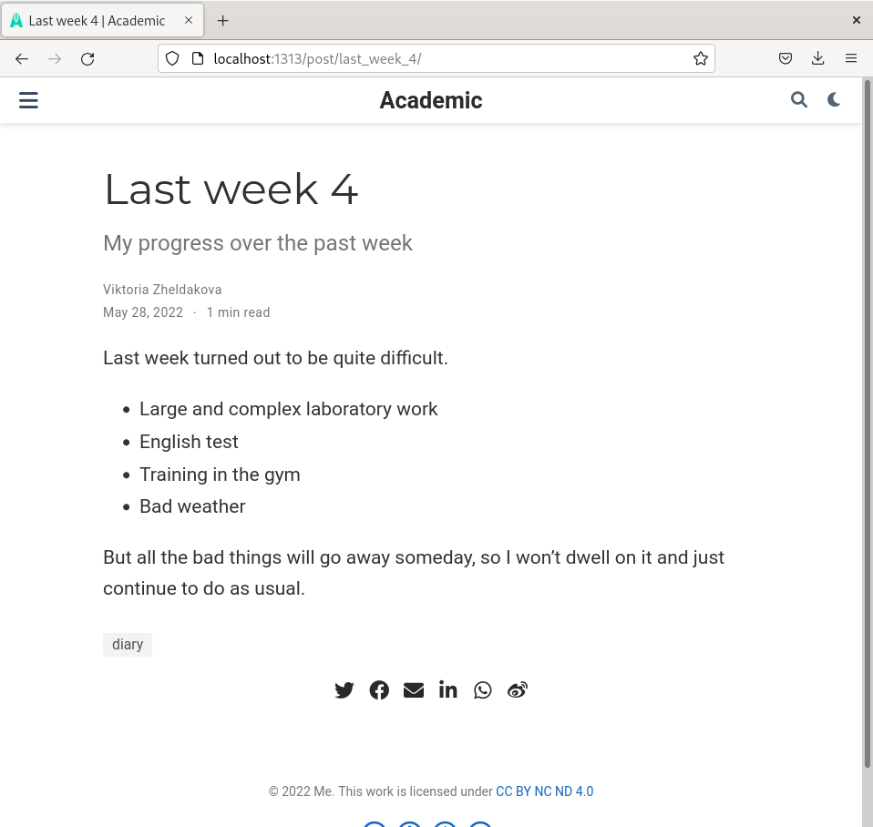
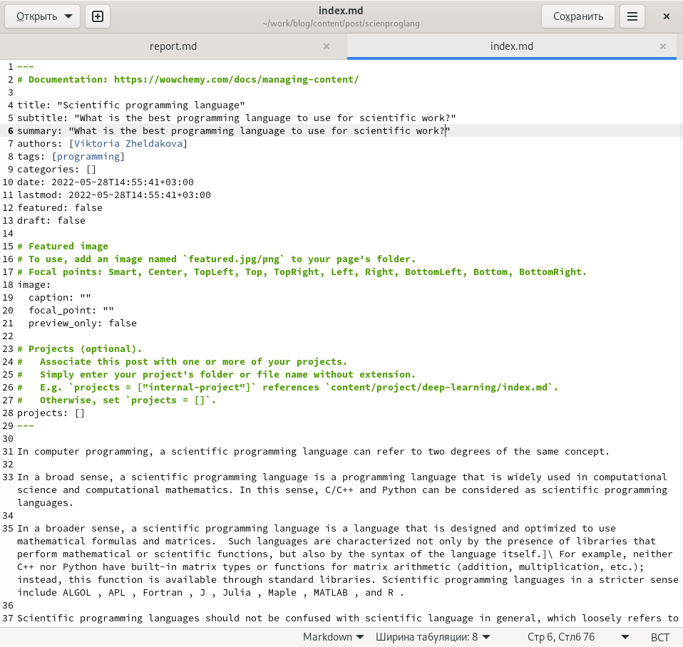
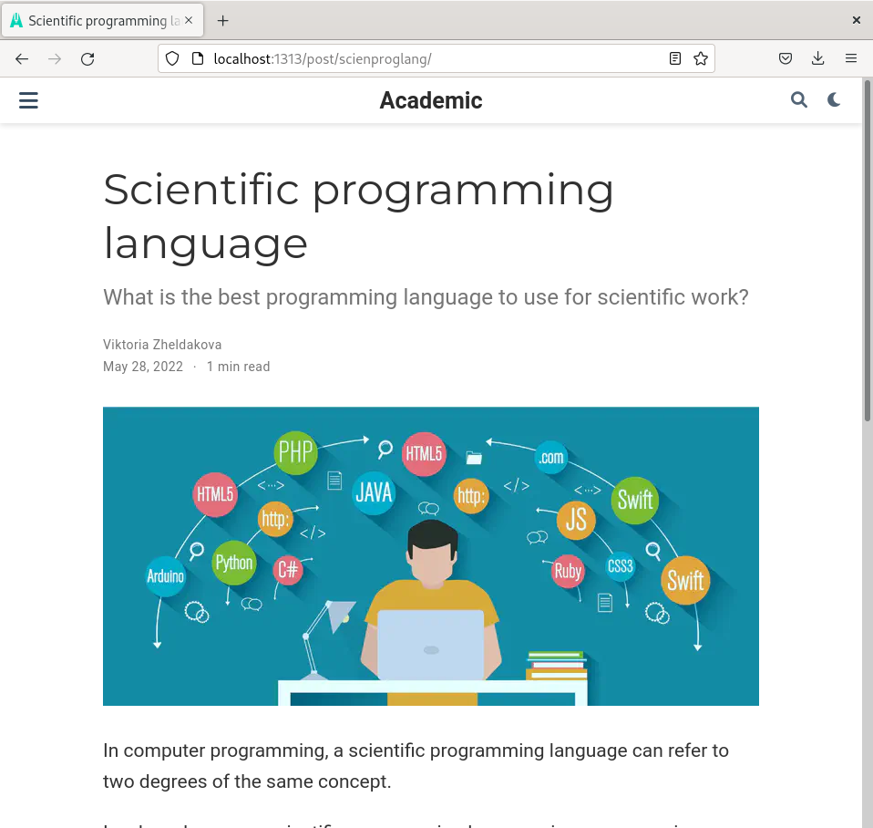

---
## Front matter
lang: ru-RU
title: Индивидуальный проект
author: Желдакова Виктория Алексеевна
institute: Российсикий университет дружбы народов
date: 28 мая 2022 г.

## I18n polyglossia
polyglossia-lang:
  name: russian
  options:
	- spelling=modern
	- babelshorthands=true
polyglossia-otherlangs:
  name: english
## I18n babel
babel-lang: russian
babel-otherlangs: english
## Fonts
mainfont: PT Serif
romanfont: PT Serif
sansfont: PT Sans
monofont: PT Mono
mainfontoptions: Ligatures=TeX
romanfontoptions: Ligatures=TeX
sansfontoptions: Ligatures=TeX,Scale=MatchLowercase
monofontoptions: Scale=MatchLowercase,Scale=0.9

## Formatting
toc: false
slide_level: 2
theme: metropolis
header-includes: 
 - \metroset{progressbar=frametitle,sectionpage=progressbar,numbering=fraction}
 - '\makeatletter'
 - '\beamer@ignorenonframefalse'
 - '\makeatother'
aspectratio: 43
section-titles: true
---

# Пятый этап

## Цель работы

 - Сделать записи для персональных проектов.
 - Сделать пост по прошедшей неделе.
 - Добавить пост на тему "Языки научного программирования".

## Создание проекта

Для создания проекта перешли в каталог /content/project/example/ и изменяли в нём файл index.md (рис. [-@fig:001] и рис. [-@fig:002])

## Создание проекта

{ #fig:001 width=70% }

## Создание проекта

{ #fig:002 width=70% }

## Создание постов

Используя команду hugo new post создали файлы для нового поста по прошедшей неделе и для поста по выбранной теме. Оформили посты и сохранили (рис. [-@fig:003], рис. [-@fig:004], рис. [-@fig:005] и рис. [-@fig:006]).

{ #fig:003 width=70% }

## Создание постов

{ #fig:004 width=70% }

## Создание постов

{ #fig:005 width=70% }

## Создание постов

{ #fig:006 width=70% }

## Выводы

 - Сделали записи для персональных проектов.
 - Сделали пост по прошедшей неделе.
 - Добавили пост на тему "Языки научного программирования".

