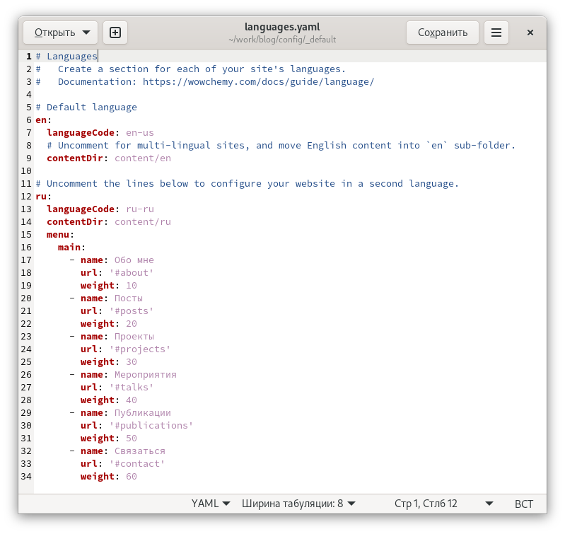
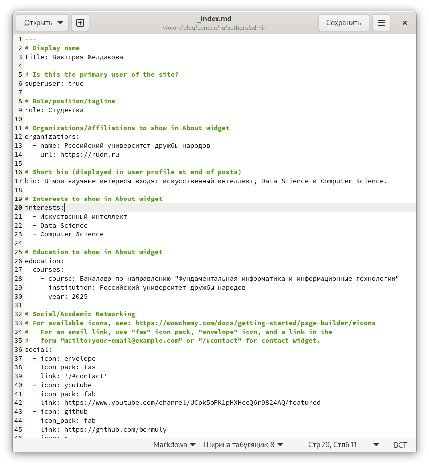
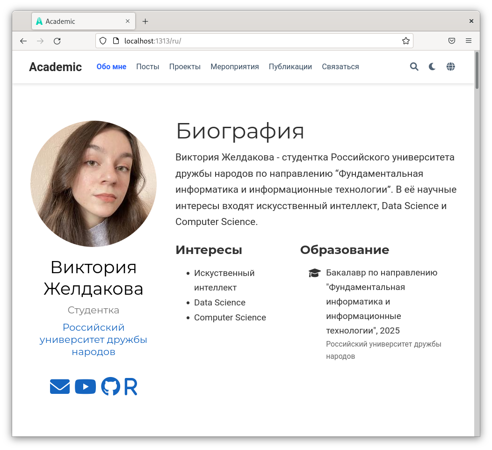
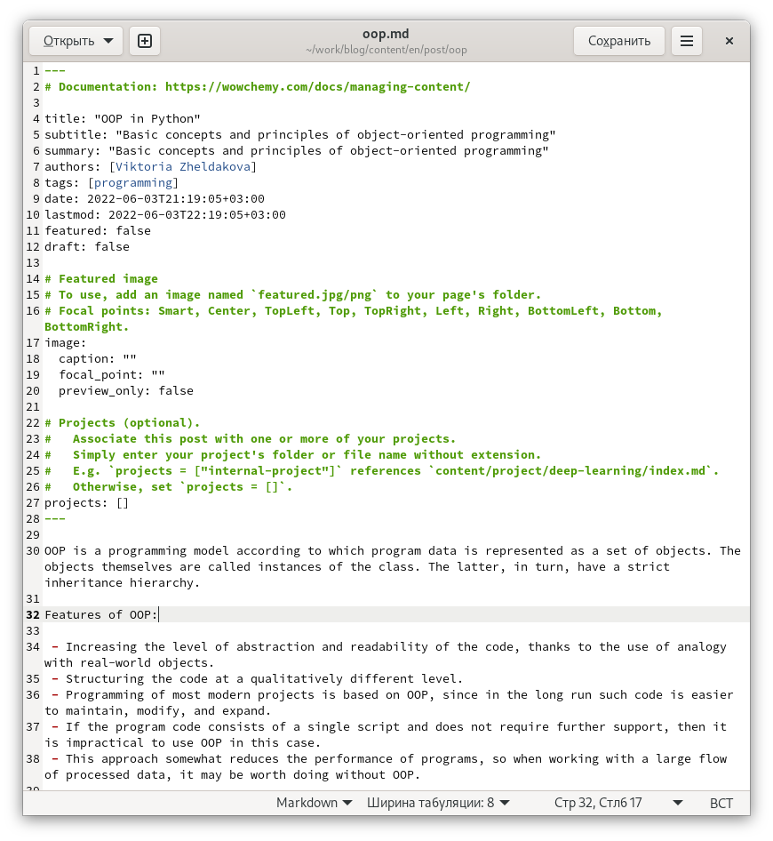
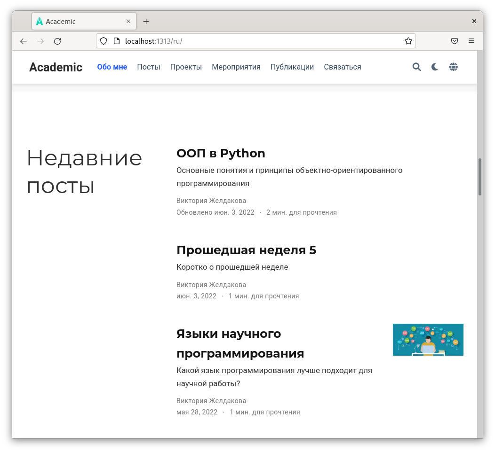
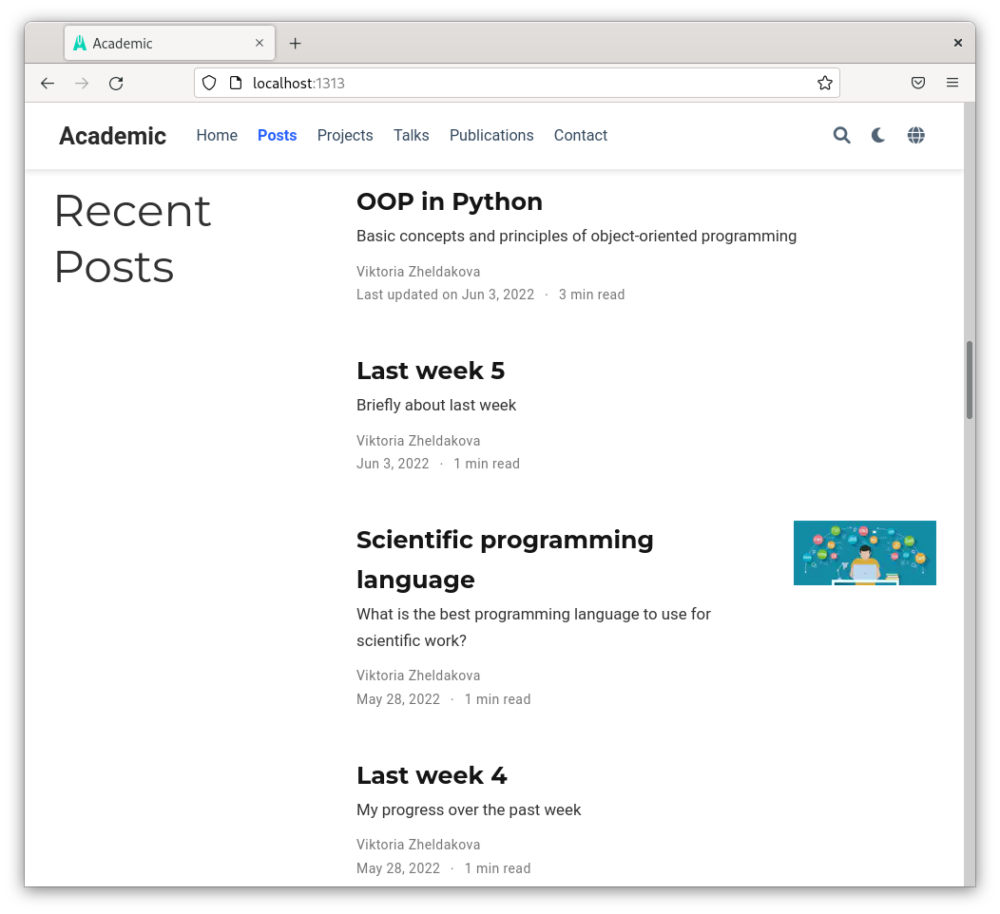

---
## Front matter
lang: ru-RU
title: Индивидуальный проект
author: Желдакова Виктория Алексеевна
institute: Российсикй университет дружбы народов
date: 3 июня 2022 г.

## I18n polyglossia
polyglossia-lang:
  name: russian
  options:
	- spelling=modern
	- babelshorthands=true
polyglossia-otherlangs:
  name: english
## I18n babel
babel-lang: russian
babel-otherlangs: english
## Fonts
mainfont: PT Serif
romanfont: PT Serif
sansfont: PT Sans
monofont: PT Mono
mainfontoptions: Ligatures=TeX
romanfontoptions: Ligatures=TeX
sansfontoptions: Ligatures=TeX,Scale=MatchLowercase
monofontoptions: Scale=MatchLowercase,Scale=0.9

## Formatting
toc: false
slide_level: 2
theme: metropolis
header-includes: 
 - \metroset{progressbar=frametitle,sectionpage=progressbar,numbering=fraction}
 - '\makeatletter'
 - '\beamer@ignorenonframefalse'
 - '\makeatother'
aspectratio: 43
section-titles: true
---

# Шестой этап

## Цель работы

 - Сделать поддержку английского и русского языков.
 - Разместить элементы сайта на обоих языках.
 - Разместить контент на обоих языках.
 - Сделать пост по прошедшей неделе.
 - Добавить пост на тему по выбору (на двух языках).

## Выполнение лабораторной работы

Для того чтобы добавить поддержку русского языка на сайте перешли в каталог content/config/_default и изменили файл languages.yaml (рис. [-@fig:001])

{ #fig:001 width=70% }

## Выполнение лабораторной работы

Всё содержимое папки content добавили в её подкаталог en, скопировали в подкаталог ru и перевели все ранее добавленные элементы на русский (рис. [-@fig:002] и рис. [-@fig:003])

{ #fig:002 width=70% }

## Выполнение лабораторной работы

{ #fig:003 width=70% }

## Выполнение лабораторной работы

Создали пост на тему по выбору и о прошедшей неделе на двух языках (рис. [-@fig:004], рис. [-@fig:005] и рис. [-@fig:006])

{ #fig:004 width=70% }

## Выполнение лабораторной работы

{ #fig:005 width=70% }

## Выполнение лабораторной работы

{ #fig:006 width=70% }

## Выводы

 - Сделали поддержку английского и русского языков.
 - Разместили элементы сайта на обоих языках.
 - Разместили контент на обоих языках.
 - Сделали пост по прошедшей неделе.
 - Добавили пост на тему по выбору (на двух языках).

